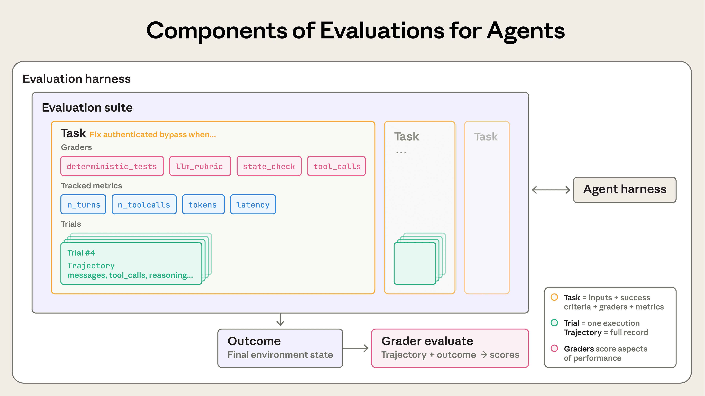
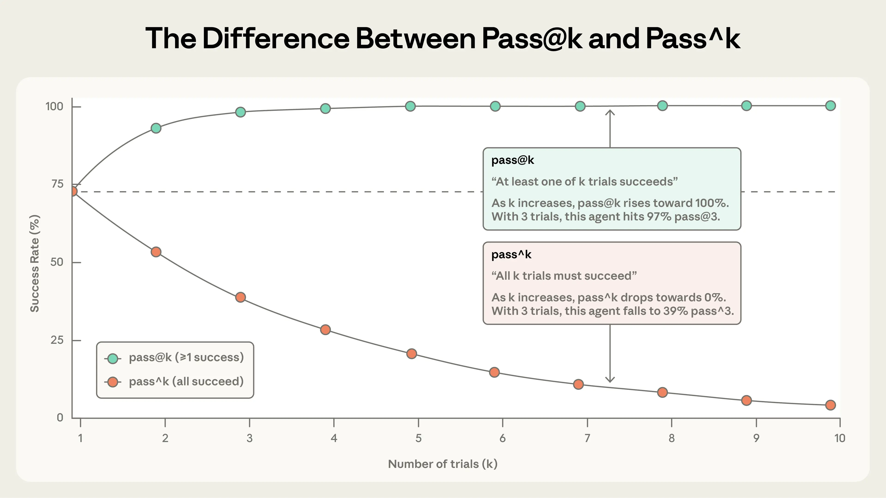

# 第 1 章 Agent 的成功标准

判断一个 Agent 做得好不好，靠的是一套事先写清、事后可查的条件。

这套条件必须回答三个问题。第一个是量什么：Agent 系统的哪些部分参与本次测评。第二个是凭什么量：一次执行能留下哪些证据。第三个是算不算成功：在什么条件下判定任务达成目标，以及要不要要求它每次都达成。三个问题回答完，团队才有条件把标准写成任务。

这份文档是下一步的直接输入：它决定了要写哪些测评任务，也决定了判定器要检查什么。

## 1.1 Agent 测评的对象

### 1.1.1 Agent 的任务执行

Agent 和普通的模型调用有一个重要区别：它的执行过程通常不是预先写死的。

普通工作流会由开发者提前安排好步骤，例如先调用模型提取信息，再查询数据库，最后生成回复。Agent 则只拿到任务、指令和一组可用工具，执行过程中自己决定下一步做什么：是继续思考、调用某个工具，还是直接回复用户[1]。

工具本质上是开发者提供给 Agent 使用的函数或接口。例如：

```
check_order_status(order_id)
```

Agent 可以把订单号传进去，再从业务系统里查询订单状态[1]。

有些工具只负责查询，调用前后业务数据不会变化；另一些工具会真正修改外部系统，例如取消订单、修改地址或者创建预订。只要涉及后一类工具，判断任务是否成功就不能只看 Agent 最后说了什么，还要检查业务系统里实际发生了什么变化。

例如，Agent 最后回复“航班已经预订成功”，并不能证明任务真的完成。真正需要检查的是订票系统里是否出现了对应的预订记录[2]。

因此，一次 Agent 执行通常会留下两类信息：一类是 Agent 和用户之间的对话，另一类是 Agent 调用了哪些工具、传入了什么参数，以及这些调用最终怎样改变了系统状态[2]。这两类信息都属于测评需要观察的对象。

Agent 的另一个特点是：完成同一个任务，可能存在多条正确路径。

例如在航空客服任务中，用户希望把最近的一张基础经济舱机票改签到当天前往旧金山。按照业务规则，基础经济舱不能直接改签，但如果购票时间还在 24 小时以内，可以先取消原订单，再重新购买。Agent 可以先查询票价和舱位规则，发现无法改签后，再向用户提出取消并重新预订[2]。

这条执行路径并不是开发者事先规定好的。另一个 Agent 也可能先查取消政策，再查订单信息，只要最终操作符合规则并完成用户目标，同样可以算成功。

因此，Agent 测评通常不要求它复现某一条固定的执行步骤。更重要的是检查：最后事情有没有办成，操作有没有违反规则，以及过程中有没有出现会影响结果的问题。

### 1.1.2 Agent 系统的测评范围

Agent 测评关注的是 **整个 Agent 系统在真实任务中的表现**。

模型只是其中一个组成部分。真正运行起来以后，它还会受到系统提示词、工具、技能、记忆、状态管理、运行框架和业务规则的共同影响[3][4]。

例如，同一个模型接入不同的工具，可能得到完全不同的任务完成率；提示词里漏掉一条业务规则，也可能让 Agent 做出错误操作。因此，单独知道模型本身有多强，并不能直接说明这个 Agent 系统能不能完成业务任务。

这也是 Agent 测评和传统模型 benchmark 的区别。

MMLU 一类 benchmark 主要用来比较模型本身的能力，ROUGE、BERTScore 等指标主要衡量某些输出特征。它们可以告诉我们模型大致处在什么水平，却没有覆盖实际业务里的工具、规则和运行环境[8]。

Agent 测评关心的问题更具体，例如：

1. 用户要求取消订单，Agent 最后有没有真的取消成功？
2. 需要先获得用户确认才能退款时，它有没有提前执行退款？
3. 调用工具时，订单号、金额、日期这些参数有没有传对？
4. 用户一次提出三个要求时，它有没有漏掉其中一个？

这些问题直接对应真实系统能不能正常工作。

所以，一套有用的测评至少要回答两件事：**这个 Agent 能不能完成任务，以及失败时问题出在哪里。**[4]。后一件事尤其重要。

> 在一组零售客服测试中，研究者人工检查了 115 条执行记录，其中有 40 条失败。排除用户指令本身存在笔误或歧义的 4 条之后，其余失败主要来自四种情况：Agent 做出了错误决定、使用了错误信息、工具参数填写错误，以及用户一次提出多个要求时只完成了一部分[2]。

把失败分成这些类型，并不是为了得到几个漂亮的百分比，而是为了知道下一步应该改哪里。

例如，工具参数经常填错，就应该继续检查 Agent 是不是没有正确识别订单号、日期、金额等关键信息；用户一次提出几个要求时经常漏掉其中一个，则应该检查 Agent 在长对话中是否还能记住并跟踪所有未完成的任务。

这两类问题最后都表现为“任务失败”，但修改的地方完全不同。只有把失败拆开，测评结果才能真正指导系统迭代。

测评还需要考虑完成任务的成本。

在零售客服实验中，Agent 侧平均每个任务约花费 0.38 美元，模拟用户侧约为 0.23 美元；把整套任务各运行一次，总成本约为 200 美元。Agent 侧 95.9% 的费用来自输入提示词，其中较长的系统提示词占了主要部分[2]。

因此，耗时、Token 消耗和工具调用成本也属于 Agent 系统表现的一部分。一个方案即使能够完成任务，如果每次执行都需要很高的成本，也会影响它是否适合实际部署。

## 1.2 测评证据

判断一次 Agent 任务是否成功，必须有可以检查的依据。

这些依据主要来自两个方面：
1. 测试任务本身规定了什么，例如用户要求做什么、什么结果算成功；
2. Agent 实际执行了什么，例如它回复了什么、调用了哪些工具，以及最终把外部系统改成了什么状态。

前一部分决定“拿什么标准来判断”，后一部分提供“实际发生了什么”的证据。测评系统就是把两者进行比较，再给出结果。

### 1.2.1 任务、试次与测评集

测评首先需要定义一个个具体的测试任务。

（1）一个任务（Task）描述一次需要 Agent 完成的事情，其中至少要明确两部分：<u>给 Agent 什么输入</u>，以及<u>满足什么条件才算成功</u>[3]。

例如，可以给客服 Agent 一个这样的任务：用户希望取消订单 A，并询问退款金额。与这个任务一起定义的成功条件可能包括：订单 A 确实被取消、退款金额回答正确，并且整个操作符合退款规则。因此，设计测评任务时，不能只写一句用户问题，还需要提前明确这个任务预期达到什么结果，以及之后准备怎样检查这个结果。一些 Agent 测评方法会把它组织成类似大模型评测中的“问题、参考结果、评价标准”三部分[5]。形式并不重要，关键是每个任务都必须把输入和成功标准对应起来。


（2）任务本身还要尽量避免歧义。

如果一句用户指令允许两种完全不同、但都合理的处理结果，那么 Agent 最后走向其中任何一个结果，都很难简单判定为对或错。τ-bench 在设计任务时，会反复修改用户指令，并让 Agent 试运行，再人工检查完整执行过程，直到确认按照给定的业务规则，这个任务最终应该得到唯一结果[2]。

这里所谓“唯一”，并不是要求 Agent 按唯一的步骤执行，而是“要求任务最终应该达到什么状态”是明确的。例如，Agent 可以采用不同顺序查询订单、政策和用户信息，只要按照业务规则，最后应该取消的是同一个订单、产生的是同一个退款结果，就仍然可以自动判断任务是否完成。


（3）同一个任务只运行一次通常还不够。

模型具有一定随机性，即使输入和环境完全相同，两次执行也可能采用不同的表达、工具调用顺序甚至决策路径。因此，同一个任务通常需要重复运行多次。每运行一次，称为一个试次（Trial）[3]。

例如，一个任务连续运行 5 次，就产生了 5 个试次。之后可以统计它成功了几次，用来判断 Agent 在这个任务上的表现是否稳定。

不同实验需要的试次数也不同。τ-bench 在验证单个任务成功率时，会让每个任务运行 40 次以上；正式结果表中的比较则至少为每个任务运行 3 次[2]。前者主要用于更稳定地估计一个任务本身的成功情况，后者用于比较不同方案的整体表现。


（4）多个任务放在一起，就组成测评集（Evaluation Suite）。

一个测评集通常围绕某一类能力或业务目标设计。例如客服 Agent 的测评集可以同时包含退款、取消订单和会员升级等任务[3]。

从长期维护的角度，还可以把任务分成不同用途的集合。例如：

- **黄金集**保存一批已经确认正确、长期用于检查基本能力的任务；
- **错题集**保存 Agent 曾经真实失败过的任务（回归类任务），用来防止同类问题再次出现；
- **挑战集**专门包含当前 Agent 还不擅长的困难任务，用来观察能力还能提升到什么程度[5]。

这里最重要的区别，是“已经应该稳定做到”和“目前还在攻克”不能混为一谈。回归类任务通常希望通过率接近 100%，因为这些能力已经被认为是系统应该稳定具备的；挑战类任务则可以故意选择当前成功率较低的问题，用来观察系统能力是否继续提升[3]。

如果把两类任务全部混在一个总分里，结果就很难解释。总通过率提高，可能是 Agent 的困难任务真的做得更好了，也可能只是测评集中增加了更多简单任务。


图注：评测从单轮问答扩展到多轮 Agent 执行后，需要检查的不再只有模型输出，还包括 Agent 对外部环境造成的实际变化。图片来自 [3]。

### 1.2.2 执行记录与最终状态

任务定义了“应该做到什么”，接下来还需要记录 Agent **实际上做了什么**。


（1）最直接的一类证据，是<u>整个执行过程的记录</u>。

一次任务运行过程中，用户发了什么消息、Agent 回复了什么、调用了哪个工具、传入了什么参数、工具返回了什么结果，都可以记录下来。这样的完整执行记录通常称为 Trace，一些资料也使用 Transcript 或 Trajectory 这个名称[3]。

从接口实现上看，它可以理解为一次任务结束后保存下来的完整交互记录，其中包含模型消息、工具调用和工具返回结果[3]。

这类记录解决的是“过程发生了什么”的问题。


（2）另一类证据是<u>最终状态（Outcome）</u>，也就是任务执行结束以后，外部系统实际变成了什么样。

例如，一个订票 Agent 最后回复：“已经为你预订成功”。这句话只能证明 Agent 声称自己完成了任务。真正判断订票是否成功，还需要检查订票系统或者数据库里是否真的出现了对应的预订记录[3]。这就是最终状态提供的证据。


（3）为什么两类证据都需要？

因为最终状态适合回答“事情最终办成没有”，执行记录适合回答“为什么成功或者为什么失败”。

例如，用户要求 Agent 修正所有订单中的错误地址。最后检查数据库发现仍有一个订单没有修改，那么最终状态已经足以说明任务失败。但它无法告诉我们 Agent 为什么漏掉这个订单。

查看执行记录之后，可能会发现 Agent 查询完第一个订单就直接停止了，没有继续检查剩余订单[2]。这时团队才能进一步判断，问题发生在任务规划、信息记忆，还是工具调用过程中。因此，记录执行过程的重要价值之一，就是让失败能够被追溯。

如果日志里只保存用户最开始说了什么，以及 Agent 最后回答了什么，中间大量信息都会丢失。一次 Agent 执行可能经历理解用户需求、选择下一步动作、调用工具、读取返回结果，再根据结果继续调整后续操作。任何一个环节出现问题，都可能导致最终失败[6]。

为了能够定位问题，测评系统至少应该保存能够还原关键执行过程的信息，包括模型实际收到和输出的内容，以及重要的工具调用记录[6]。

这些记录通常由两层运行框架产生。

- 第一层是 **Agent 运行框架（Agent Harness，也叫 Scaffold）**。它负责真正运行 Agent，例如接收输入、把工具提供给模型、处理工具调用，再把执行结果返回给用户。实际测评时，模型是在这套运行框架中工作的，因此测到的是模型和运行框架共同产生的结果[3]。

- 第二层是**测评运行框架（Evaluation Harness）**。它不负责替 Agent 做任务，而是负责组织整个测试过程，例如准备任务和环境、批量运行多个试次、保存执行记录、调用判断逻辑，最后汇总测评结果[3]。

可以简单理解为：**Agent 运行框架负责“把任务做起来”，测评运行框架负责“把测试跑起来并记录结果”。**




图注：一个测评集包含多个任务，每个任务可以重复运行多个试次。一次试次会产生执行记录和最终状态，判断逻辑根据这些证据判断任务是否成功。图片来自 [3]。


### 1.2.3 Run、Trace 与 Thread

## 1.2 测评证据

判断一次 Agent 任务是否成功，必须有可以检查的依据。

这些依据主要来自两个方面：一是**测试任务本身规定了什么**，例如用户要求做什么、什么结果算成功；二是**Agent 实际执行了什么**，例如它回复了什么、调用了哪些工具，以及最终把外部系统改成了什么状态。

前一部分决定“拿什么标准来判断”，后一部分提供“实际发生了什么”的证据。测评系统就是把两者进行比较，再给出结果。

### 1.2.1 任务、试次与测评集

测评首先需要定义一个个具体的测试任务。

一个任务（`Task`）描述一次需要 Agent 完成的事情，其中至少要明确两部分：**给 Agent 什么输入，以及满足什么条件才算成功**[3]。

例如，可以给客服 Agent 一个这样的任务：

> 用户希望取消订单 A，并询问退款金额。

与这个任务一起定义的成功条件可能包括：订单 A 确实被取消、退款金额回答正确，并且整个操作符合退款规则。

因此，设计测评任务时，不能只写一句用户问题，还需要提前明确这个任务预期达到什么结果，以及之后准备怎样检查这个结果。

一些 Agent 测评方法会把它组织成类似大模型评测中的“问题、参考结果、评价标准”三部分[5]。形式并不重要，关键是每个任务都必须把**输入和成功标准对应起来**。

任务本身还要尽量避免歧义。

如果一句用户指令允许两种完全不同、但都合理的处理结果，那么 Agent 最后走向其中任何一个结果，都很难简单判定为对或错。τ-bench 在设计任务时，会反复修改用户指令，并让 Agent 试运行，再人工检查完整执行过程，直到确认按照给定的业务规则，这个任务最终应该得到唯一结果[2]。

这里所谓“唯一”，并不是要求 Agent 按唯一的步骤执行，而是要求**任务最终应该达到什么状态是明确的**。

例如，Agent 可以采用不同顺序查询订单、政策和用户信息，只要按照业务规则，最后应该取消的是同一个订单、产生的是同一个退款结果，就仍然可以自动判断任务是否完成。

同一个任务只运行一次通常还不够。

模型具有一定随机性，即使输入和环境完全相同，两次执行也可能采用不同的表达、工具调用顺序甚至决策路径。因此，同一个任务通常需要重复运行多次。每运行一次，称为一个试次（`Trial`）[3]。

例如，一个任务连续运行 5 次，就产生了 5 个试次。之后可以统计它成功了几次，用来判断 Agent 在这个任务上的表现是否稳定。

不同实验需要的试次数也不同。τ-bench 在验证单个任务成功率时，会让每个任务运行 40 次以上；正式结果表中的比较则至少为每个任务运行 3 次[2]。前者主要用于更稳定地估计一个任务本身的成功情况，后者用于比较不同方案的整体表现。

多个任务放在一起，就组成测评集（`Evaluation Suite`）。

一个测评集通常围绕某一类能力或业务目标设计。例如客服 Agent 的测评集可以同时包含退款、取消订单和会员升级等任务[3]。

从长期维护的角度，还可以把任务分成不同用途的集合。例如：

- **黄金集**保存一批已经确认正确、长期用于检查基本能力的任务；
- **错题集**保存 Agent 曾经真实失败过的任务，用来防止同类问题再次出现；
- **挑战集**专门包含当前 Agent 还不擅长的困难任务，用来观察能力还能提升到什么程度[5]。

这里最重要的区别，是“已经应该稳定做到”和“目前还在攻克”不能混为一谈。

回归类任务通常希望通过率接近 100%，因为这些能力已经被认为是系统应该稳定具备的；挑战类任务则可以故意选择当前成功率较低的问题，用来观察系统能力是否继续提升[3]。

如果把两类任务全部混在一个总分里，结果就很难解释。总通过率提高，可能是 Agent 的困难任务真的做得更好了，也可能只是测评集中增加了更多简单任务。


图注：评测从单轮问答扩展到多轮 Agent 执行后，需要检查的不再只有模型输出，还包括 Agent 对外部环境造成的实际变化。图片来自 [3]。

### 1.2.2 执行记录与最终状态

任务定义了“应该做到什么”，接下来还需要记录 Agent **实际上做了什么**。

最直接的一类证据，是整个执行过程的记录。

一次任务运行过程中，用户发了什么消息、Agent 回复了什么、调用了哪个工具、传入了什么参数、工具返回了什么结果，都可以记录下来。这样的完整执行记录通常称为 `Trace`，一些资料也使用 `Transcript` 或 `Trajectory` 这个名称[3]。

从接口实现上看，它可以理解为一次任务结束后保存下来的完整交互记录，其中包含模型消息、工具调用和工具返回结果[3]。

这类记录解决的是“过程发生了什么”的问题。

另一类证据是最终状态（`Outcome`），也就是任务执行结束以后，外部系统实际变成了什么样。

例如，一个订票 Agent 最后回复：

> 已经为你预订成功。

这句话只能证明 Agent **声称**自己完成了任务。

真正判断订票是否成功，还需要检查订票系统或者数据库里是否真的出现了对应的预订记录[3]。这就是最终状态提供的证据。

为什么两类证据都需要？

因为最终状态适合回答“事情最终办成没有”，执行记录适合回答“为什么成功或者为什么失败”。

例如，用户要求 Agent 修正所有订单中的错误地址。最后检查数据库发现仍有一个订单没有修改，那么最终状态已经足以说明任务失败。

但它无法告诉我们 Agent 为什么漏掉这个订单。

查看执行记录之后，可能会发现 Agent 查询完第一个订单就直接停止了，没有继续检查剩余订单[2]。这时团队才能进一步判断，问题发生在任务规划、信息记忆，还是工具调用过程中。

因此，记录执行过程的重要价值之一，就是让失败能够被追溯。

如果日志里只保存用户最开始说了什么，以及 Agent 最后回答了什么，中间大量信息都会丢失。一次 Agent 执行可能经历理解用户需求、选择下一步动作、调用工具、读取返回结果，再根据结果继续调整后续操作。任何一个环节出现问题，都可能导致最终失败[6]。

为了能够定位问题，测评系统至少应该保存能够还原关键执行过程的信息，包括模型实际收到和输出的内容，以及重要的工具调用记录[6]。

这些记录通常由两层运行框架产生。

第一层是 Agent 运行框架（`Agent Harness`，也叫 `Scaffold`）。它负责真正运行 Agent，例如接收输入、把工具提供给模型、处理工具调用，再把执行结果返回给用户。实际测评时，模型是在这套运行框架中工作的，因此测到的是模型和运行框架共同产生的结果[3]。

第二层是测评运行框架（`Evaluation Harness`）。它不负责替 Agent 做任务，而是负责组织整个测试过程，例如准备任务和环境、批量运行多个试次、保存执行记录、调用判断逻辑，最后汇总测评结果[3]。

可以简单理解为：

**Agent 运行框架负责“把任务做起来”，测评运行框架负责“把测试跑起来并记录结果”。**


图注：一个测评集包含多个任务，每个任务可以重复运行多个试次。一次试次会产生执行记录和最终状态，判断逻辑根据这些证据判断任务是否成功。图片来自 [3]。


### 1.2.3 Run、Trace 与 Thread

前面讨论的是一次任务需要保存哪些证据。实际设计测评时，还有一个问题需要提前确定：**一次测试到底准备检查多大范围的执行过程？**

有些问题只需要检查 Agent 的一个动作，有些需要看完整的一轮任务，还有一些只有放到连续多轮对话里才能发现。


LangChain 将这些范围分成三个层次：`Run`、`Trace` 和 `Thread`[7]。


`Run` 是最小的一层，可以理解为一次具体的模型调用或工具调用。

例如，已经知道这一步应该查询订单状态，那么就可以只检查：

- Agent 有没有选择正确的工具；
- 订单号有没有传对；
- 这一轮调用得到的结果是否符合预期。

这种测法适合定位非常具体的问题。它执行得快，成本低，而且一旦失败，通常很容易知道究竟是哪一步出了问题[7]。


`Trace` 往上一层，表示 Agent 完成一轮任务时的完整执行过程。

例如用户要求：

> 把我文档里的收货地址改成新的地址。

为了判断这一轮任务是否完成，可以同时检查几件事：Agent 是否修改了正确的文档，文档里的地址是否真的发生变化，以及最终回复是否正确告诉用户修改已经完成[7]。

这一层关注的是一次完整任务有没有正确完成，同时仍然可以利用其中的工具调用记录分析过程。


`Thread` 再往上一层，表示由多轮交互组成的一整段会话[7]。

有些问题单独看每一轮都没有明显错误，放到整段对话中才会暴露出来。例如用户第一轮提出一个要求，几轮之后补充新的条件；或者在完成一个任务之后，又把目标改成另一个任务。此时需要检查 Agent 能不能记住前文的重要信息、正确处理需求变化，并最终把整件事情完成。这类能力只测单轮是不够的。一个 Agent 可能有 90% 的单轮回复看起来都合理，但最后仍然没有完成用户真正想做的事情[7]。因此，多轮 Agent 还需要从整个会话的角度检查：用户最终想完成什么、任务有没有真正完成，以及失败发生在对话的哪个阶段。


这三个层次解决的问题不同。`Run` 最适合定位某一个具体动作有没有出错；`Trace` 适合判断一轮完整任务是否正确完成；`Thread` 适合检查跨多轮对话的任务完成情况。实际测评中通常需要把它们结合起来：较大的范围告诉团队**整个任务有没有出问题**，较小的范围帮助团队继续定位**具体是哪一步出了问题**[7]。

> 需要特别注意的是，`Trace` 这个词在不同资料中的用法并不完全一样。前文引用 Anthropic 的定义时，`Trace` 指的是一次试次留下的完整执行记录，与 `Transcript`、`Trajectory` 接近[3]；LangChain 在区分 `Run / Trace / Thread` 时，则把 `Trace` 专门用来表示一轮 Agent 执行，它的范围可能小于整个多轮任务[7]。


因此，实际编写测评任务和统计结果时，不能只写“记录 Trace”或者“按 Trace 统计”，还需要明确这里具体指的是**一次调用、一轮任务，还是整段多轮会话**。否则不同测试使用的统计范围不同，最终结果就无法直接比较。


## 1.3 成功条件

成功条件回答的是一个最基本的问题：**一次 Agent 任务做到什么程度，才能算真正完成。**

这些条件，应该从“用户真正想完成的事情”和“业务中必须遵守的规则”出发，再转化成可以实际检查的结果、过程和限制[8]。


### 1.3.1 用户目标与业务目标

设计成功条件时，首先要弄清两件事：**用户想完成什么，以及业务上有哪些要求不能违反。**

> 例如，用户可能希望取消订单并拿回退款，这是用户目标；而业务系统可能规定只有满足退款条件、并经过用户确认后才能执行退款，这些属于业务规则和风险限制。

这两类内容决定了 Agent 应该完成什么，但它们通常还不能直接拿来打分。“让用户顺利完成退款”这样的目标太宽泛，测评系统无法直接判断它是真是假。**真正用于测评的，需要是可以观察和验证的事实**，例如：

- 是否取消了正确的订单；
- 退款金额是否正确；
- 执行退款前是否取得了用户确认；
- 最终数据库里的订单状态是否正确。

这些可检查的事实把用户目标和业务要求落实到了具体任务上，也是成功条件真正要描述的内容。


从整个产品来看，还可以把目标分成几个层次。业务团队可能关注活跃度、留存、转化等最终结果；一个搜索系统可能进一步关注召回率、点击率；到了 Agent 本身，则需要检查意图有没有理解正确、该查的信息有没有查到、工具有没有正确使用、最终结果是否可信[4]。**这些层次之间有关系，但不能直接互相替代**。业务指标变差，并不能直接说明是哪一次 Agent 决策出了问题；反过来，模型某项能力提高，也不意味着业务指标一定随之提升。因此，Agent 测评需要把宽泛的业务目标继续拆成具体、可检查的任务条件，团队才能知道问题究竟发生在哪一层[4]。


设计顺序也应该从目标出发：**先明确用户要完成什么，再列出必须遵守的业务规则和风险限制，最后把它们转化成成功条件**。如果顺序反过来，团队很容易围绕手头已经有的指标设计测试，最后得到一堆分数，却很难解释这些分数与真实业务有什么关系。

**测评任务本身还要覆盖真实用户可能遇到的情况**。除了最常见的正常请求，也应该包含边缘情况和容易诱发错误的输入[8]。这样测出的结果才更接近 Agent 上线后的实际表现，而不是只说明它在一组理想问题上表现良好。


### 1.3.2 单次任务的成功条件

对于一次具体任务，可以从四个方面判断它是否完成：**结果是否正确、操作是否合规、执行过程是否可靠，以及成本是否可以接受。**

（1）第一类是**任务完成条件**，也就是最终事情有没有办成。

只要外部状态能够直接检查，就应该优先检查实际结果，而不是相信 Agent 自己的描述。

> 例如退货任务中，可以检查数据库里的订单是否真的进入了正确的退货状态，同时检查最终回复中的退款金额是否正确[2]。

τ-bench 的一种实现把这两部分分别记为动作结果和回复结果，再结合起来决定任务是否成功。这样做的核心思想很简单：Agent 可以自由选择具体执行路径，但最终必须到达正确的结果[2]。

因此，成功条件通常不需要规定 Agent 必须先调用哪个工具、再调用哪个工具。只要不同路径都符合规则并得到正确结果，就应该允许它们存在。

（2）第二类是**规则与安全条件**。

最终结果正确，并不代表整个操作一定正确。Agent 有可能在没有取得用户确认的情况下就执行退款，最后数据库里的退款状态完全正确，但执行过程已经违反业务规则[2]。

有些限制可以由工具或业务系统自动执行。例如传入一个不存在的支付方式，接口可以直接拒绝操作。这类规则即使 Agent 判断错误，也可能被系统挡住。

另一些规则只能依靠 Agent 自己遵守。例如不同会员等级和舱位对应不同的免费行李额度，接口未必会自动替 Agent 判断正确件数[2]。这种情况下，仅检查最终数据库状态并不够，还要查看执行记录，确认 Agent 是否按照规则做出了正确决策。

规则本身的复杂程度也会影响测评结果。τ-bench 的实验中，把业务规则从系统提示词中移除后，在规则较简单的零售客服任务上，`gpt-4o` 的 `pass^1` 只下降了 4.4%；而在行李额度取决于会员等级和舱位的航空任务中，同样的改动让 `gpt-4o` 下降了 22.4%[2]。这说明不同任务对业务规则的依赖程度并不相同，测评时最好把这些场景分别观察，而不是只看一个混合后的总分。

（3）第三类是**过程质量条件**。

它关注 Agent 在完成任务的过程中，有没有遗漏会影响正确性、安全性或用户体验的重要步骤。

> 例如，Agent 是否收集了完成任务所需的信息，是否用工具核实了关键事实，任务完成后是否向用户交代了结果[4]。

对于对话式 Agent，交互过程本身也是任务的一部分。一个客服任务可能同时要求：工单最终得到解决、整个过程不超过 10 轮对话，并且回复方式符合服务要求[3]。这些要求分别对应最终状态、执行过程和交互质量，不能只用一个“回答正确”来代替。

不过，检查过程不等于规定一条固定执行路线。

如果测试要求 Agent 必须严格按照某个预先设计好的顺序调用工具，很容易把正确但不同的执行方式误判成失败[7]。通常更合理的做法是检查那些真正影响结果的关键行为，例如该确认的信息有没有确认、该执行的操作有没有执行。只有当顺序本身涉及正确性或安全性时，才需要明确限制执行顺序。

（4）第四类是**效率条件**。

任务能够完成，还要考虑完成它需要付出多少时间和计算成本。常见指标包括执行耗时、Token 消耗、工具调用次数和对话轮数[4]。

效率条件必须带有明确的比较标准。例如，可以规定一次任务最多允许 Agent 执行 30 个动作，超过这个上限就停止[2]。如果只记录“用了多少 Token”或者“调用了多少次工具”，却没有任何阈值或基准，就只能得到一项统计数据，无法判断它究竟是否合格。


把这四类条件放在一起，可以比较完整地描述一次任务的质量。

两个 Agent 可能都得到正确结果，但其中一个只用了几次稳定、必要的工具调用，另一个反复试错几十次后偶然得到同样结果。从最终状态看，两者都是成功；从实际部署的稳定性、成本和用户体验来看，它们显然不是同一种表现[4]。

因此，一个任务的成功条件应该覆盖真正影响使用结果的那些方面。条件也不需要越多越好，没有实际判断价值的检查项只会让测评越来越复杂。

### 1.3.3 可靠性

即使一个 Agent 在某次测试中成功，也不能因此认为它能够稳定完成这个任务。

语言模型的输出具有随机性。在输入、工具和环境保持不变的情况下，同一个任务重复运行，Agent 仍可能采用不同的表达和执行方式，最终结果也可能一次成功、一次失败[2][3]。因此，除了判断“这一次有没有成功”，有些任务还需要继续判断：**同一种任务重复出现时，Agent 能不能持续成功。**

这就是可靠性要衡量的问题。

假设同一个任务运行多次，每一次的任务含义和关键环境条件都保持一致，就可以观察 Agent 在这些重复试次中的表现。一个真正可靠的 Agent，应该在多数甚至所有试次中都满足前面定义的成功条件。

常见的两个指标是 `pass@k` 和 `pass^k`[2]。

- `pass@k` 关注的是：同一个任务运行 k 次，**至少有一次成功**的概率。例如，一个代码生成 Agent 可以连续尝试几种方案，只要其中一个能够运行，用户就可能得到价值。这类场景适合关注 `pass@k`。

- `pass^k` 关注的是：同一个任务运行 k 次，**每一次都成功**的概率。客服、支付、订单处理等任务通常更接近这种要求。用户不会因为同样的退款请求“十次里面有一次能成功”就认为系统可靠，因此这类任务更需要关注连续成功能力[3]。

两个指标随着 k 增加会朝不同方向变化。`pass@k` 会越来越高，因为尝试次数越多，至少成功一次的机会越大；`pass^k` 会越来越低，因为连续多次全部正确越来越困难[3]。

> 例如，如果一个任务单次成功率是 75%，连续三次全部成功的概率只有：`0.75 × 0.75 × 0.75 ≈ 42%`

这也是为什么一个看起来不错的平均成功率，放到实际重复使用中可能仍然显得不稳定。τ-bench 的实验中，函数调用 Agent 的平均任务成功率超过 60%，但 `pass^8` 已经下降到 25% 以下[2]。



图注：同样的单次成功率在多次试次下给出两种结论。图片来自 [3]。


因此，是否需要把可靠性写进成功标准，**取决于用户会怎样使用这个 Agent**。如果任务允许多次尝试，只需要其中一次得到可用结果，可以关注 `pass@k`；如果用户每次提出同类请求都期待稳定得到正确结果，就需要明确可靠性要求，例如规定重复运行多少次、允许失败几次，以及最终采用什么指标判断。

可靠性指标本身也要保持一致。相同的一批测试，在不同时间、不同机器或者由不同人员执行时，如果没有发生实质变化，结果不应该出现无法解释的大幅波动[5]。否则团队看到分数变化时，就无法判断究竟是 Agent 真的变了，还是测评方法本身不稳定。


## 1.4 成功标准文档

前面的结论可以收成一页文档。这一页固定判定所依据的对象和条件，不展开测评任务的细节。这样处理有两个理由。条件需要有共同依据，两位领域专家读到同一份任务时，才可能独立给出相同的通过结论[3]。条件也需要有出处，判定结果每一次追溯，都要落到某个写下来的要求上。

这一页至少包含五栏。

- 测评对象的范围：模型、提示词、工具、运行框架和环境里，哪些部分属于本次测评。
- 用户目标和相关业务规则，包括必须遵守的领域政策和风险限制。
- 单次任务要检查的完成、规则与安全、过程质量和效率条件。
- 是否需要检查跨试次可靠性，以及可靠性的产品要求。
- 每项条件需要的证据：最终回复、执行记录、最终状态或运行数据。

栏目之间的依赖是单向的。用户目标和业务规则决定保留哪些条件，条件决定需要哪些证据，证据又决定要为任务准备什么输入和环境。判定只读取这一页声明过的证据，没有声明的证据不进入判定，因此遗漏证据的后果是判定无法执行，而不是判定放松要求。

写不出来的一栏不能先用占位结论填上。缺条件意味着这个任务无法写出成功标准，缺证据意味着它无从检查。这两种缺口都应该在转入任务设计之前暴露出来。

下一章会把这一页转换成可重复执行的测评任务。

## 参考文献

1. OpenAI. [Evaluation best practices](https://developers.openai.com/api/docs/guides/evaluation-best-practices?api-mode=responses). `Single-agent architectures`。
2. Sierra. [τ-bench: benchmarking AI agents for the real-world](https://sierra.ai/resources/research/tau-bench)（论文《τ-bench: A Benchmark for Tool-Agent-User Interaction in Real-World Domains》，arXiv:2406.12045v1）。`Abstract`、`1. Introduction`、`3 τ-bench`、`4.2 Key Characteristics`、`5. Experiments`。
3. Anthropic. [Demystifying evals for AI agents](https://www.anthropic.com/engineering/demystifying-evals-for-ai-agents). `The structure of an evaluation`、`Why build evaluations?`、`Evaluating conversational agents`、`How to think about non-determinism in evaluations for agents`、`Step 2: Write unambiguous tasks with reference solutions`、`Design the eval harness and graders`。
4. 美团。[Agent 评测漫谈——由浅入深讲解 Agent 评测](https://tech.meituan.com/2026/08/07/Agent-Evaluation.html). `1.1 评测的核心目的`、`1.2 Agent 评测与传统模型评测的不同`、`1.3 为什么 Agent 评测不是只看结果，还要看行为和过程`、`1.4 为什么说观测是评测的基石`、`2.1 评测体系的核心不是堆指标，而是搭桥`。
5. 美团。[《Agent 评测白皮书》系列 01：Agent 评测全览](https://tech.meituan.com/2026/09/10/Agent-Evaluation-White-Paper-01.html). `1.1 回到原点`、`1.3 评测体系的三种能力`、`2.1.1 评测集的构成`。
6. 美团。[《Agent 评测白皮书》系列 01：Agent 评测全览](https://tech.meituan.com/2026/09/10/Agent-Evaluation-White-Paper-01.html). `五、Agent 观测基建：一切的地基`。
7. LangChain. [Evaluating AI Agents at the Run, Trace, and Thread Level](https://www.langchain.com/resources/agent-evals). `Three levels of agent evaluation`。
8. OpenAI. [Evaluation best practices](https://developers.openai.com/api/docs/guides/evaluation-best-practices?api-mode=responses). `What are evals?`、`How to read evals`。
