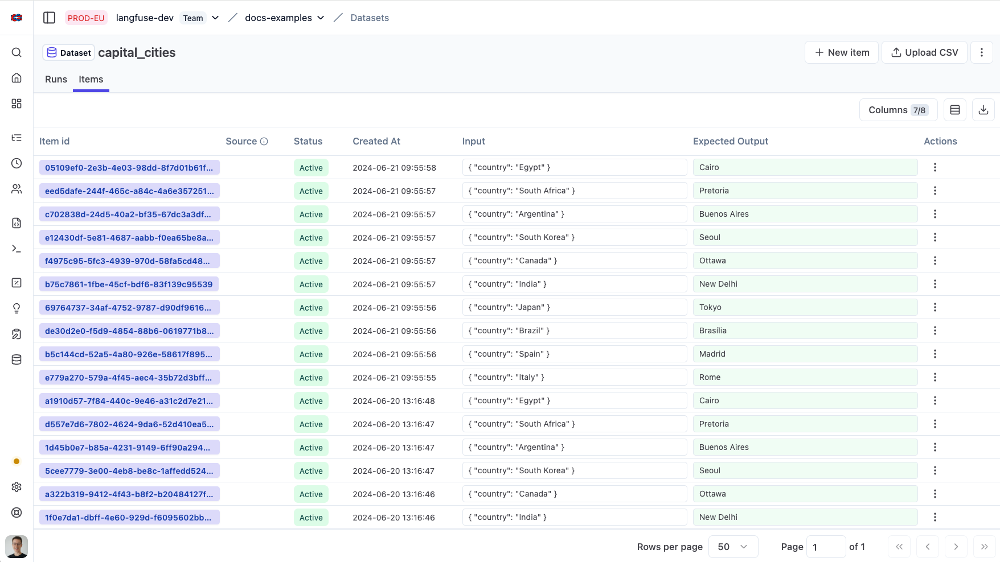
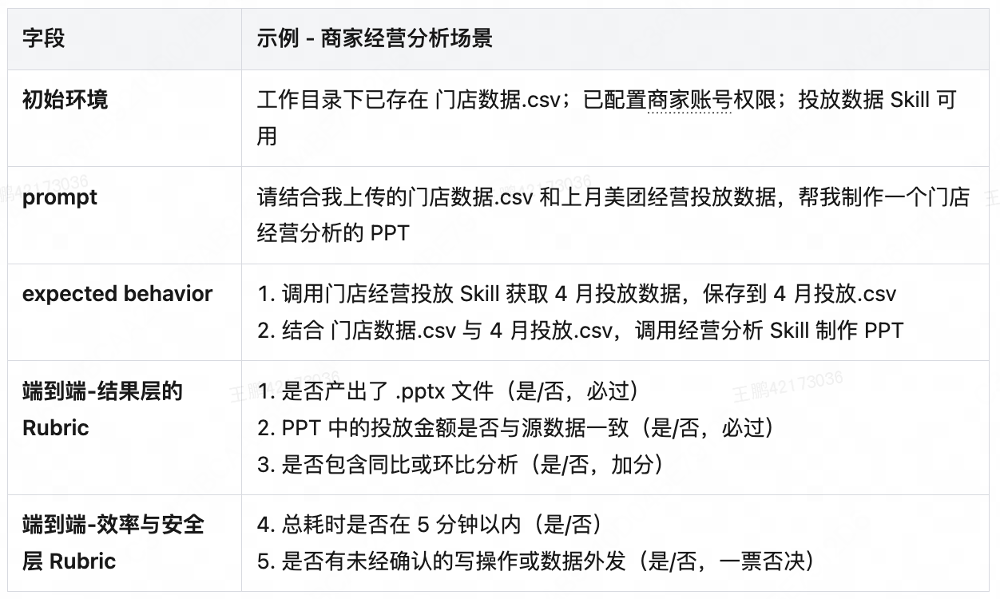

# 第 2 章 测评任务设计

一个测评任务真正能够运行起来，需要依次解决几个问题：

首先，要把任务本身描述完整，明确一份任务需要记录哪些内容；

其次，要确定 Agent 从什么输入和环境开始执行；

然后，要写清任务完成后应该得到什么结果，以及执行过程中必须遵守哪些限制。

任务写完后，还需要检查它本身是否清楚、可完成并贴近真实场景，最后通过实际运行验证这些设计是否成立。

## 2.1 任务规格

任务规格（`Task Specification`）可以理解为**一个测评任务的完整说明**。它不仅包含用户对 Agent 提出的请求，还要写清执行任务所需的环境、最终应该达到的结果、执行过程中必须遵守的限制，以及测评结束后需要检查哪些信息[1][2][3]。

它的作用很直接：另一个人只看这份规格，也应该能够准备出相同的测试条件，并知道任务结束以后应该检查什么。如果缺少关键的初始数据、工具配置或者判断依据，那么重新运行时实际面对的就已经不是同一个任务。

普通的大模型测评往往只需要保存输入和期望输出。例如，输入一个国家名称，期望模型输出对应的首都。这种结构适合一次模型调用，因为模型本身不会改变外部世界[3]。

Agent 任务要复杂一些。Agent 可能查询数据库、修改文件、创建订单，甚至调用外部服务，因此仅仅保存“输入是什么、答案是什么”还不够。任务规格还必须说明**Agent 在什么环境中执行，以及执行完成以后环境应该发生什么变化**。

图注：数据集条目的结构只有输入和期望输出两项，逐行构成可反复运行的用例。图片来自 [3]。

### 2.1.1 任务规格的组成

一份完整的任务规格通常需要包含五方面内容：

1. **任务输入**：Agent 一开始能够获得哪些信息；
2. **执行环境**：Agent 可以使用哪些工具，面对什么初始数据和权限；
3. **预期结果**：任务完成以后应该得到什么；
4. **行为约束**：执行过程中有哪些规则不能违反；
5. **判定证据**：任务结束以后，要读取哪些信息来判断前面的要求是否满足。

这五部分分别解决不同的问题。

- 任务输入和执行环境共同规定了 Agent 的**起始条件**。例如，用户说了什么、已有哪段对话、数据库里当前有什么订单，以及 Agent 可以调用哪些接口。

- 预期结果和行为约束则规定了**什么才算完成任务**。前者关注最终要得到的结果，例如订单被取消、文件被创建或者正确金额被返回；后者关注完成任务时必须遵守的要求，例如退款前必须获得用户确认，或者 Agent 只能修改当前用户自己的订单。

- 最后的判定证据说明**测评系统准备依据什么检查这些要求**。如果要验证订单是否真的取消，就需要读取订单最终状态；如果要检查是否在退款前获得确认，就需要保留完整对话和工具调用记录。

因此，这五部分之间存在很自然的顺序：**先确定 Agent 面对什么任务和环境，再定义什么结果算成功、有哪些限制，最后决定需要保存哪些证据来验证它们。**

>  例如，可以设计这样一个零售客服任务：用户希望退回一只水杯，并询问能够退回多少钱。任务开始时，系统中已经存在对应订单，Agent 可以查询订单并发起退货。根据业务规则，商品必须处于允许退货的状态，而且真正提交退款以前必须得到用户确认。
>
> 那么这份任务规格可以写成：
>
> - **任务输入**：用户提出退货请求，并说明对应商品；
> - **执行环境**：包含该用户的订单数据，并提供订单查询和退货接口；
> - **预期结果**：正确订单进入退货状态，产生正确金额的退款，Agent 向用户说明退款金额；
> - **行为约束**：商品必须符合退货条件，退款前必须得到确认，不能修改无关账户信息；
> - **判定证据**：最终订单状态、支付记录、Agent 与用户的对话，以及相关工具调用记录。
>
> 这样一来，任务要做什么、怎样才算成功，以及最后如何检查，都已经明确下来。

图注：一条填好的任务规格，把输入、预期行为、预期结果和约束分成不同栏目，并按必须通过与加分两类标注检查项。图片来自 [7]。

## 2.2 任务输入与执行环境

任务输入和执行环境共同决定了 Agent **从什么条件开始完成任务**。

任务输入关注 Agent 一开始知道什么，执行环境关注它能够访问和改变什么。两者都需要尽量接近实际使用场景，否则测到的可能只是一个人为简化后的任务，而不是产品真正面对的问题[1][4]。

### 2.2.1 任务输入

（1）任务输入首先要明确：**任务开始时，哪些信息应该直接告诉 Agent，哪些信息应该由 Agent 自己获取。**

最直接的一部分是用户请求。例如：

> 帮我把昨天买的水杯退掉。

除此之外，Agent 还可能天然拥有一些上下文，例如此前的对话、当前登录用户的信息、代码仓库的当前状态，或者系统已经提供的业务上下文。**不能**为了让测试方便，把本来应该由 Agent 自己寻找的信息全部提前写进用户请求。

> 早期的一些工具调用基准会直接把完成任务需要的信息全部放进初始指令。例如明确告诉 Agent 订单号、商品编号、退款方式以及其他必要字段。这样设计很容易执行和自动判定，但它绕开了真实 Agent 经常需要处理的问题：用户可能只说“退掉昨天买的水杯”，Agent 需要自己查询订单，必要时还要继续询问用户[4]。

用户知道并且通常会主动表达的信息，可以通过用户请求给出；系统本来就会提供给 Agent 的上下文，可以直接放进初始状态；只有通过业务系统查询才能获得的信息，则应该让 Agent 自己调用工具获取。

（2）多轮任务还需要处理用户后续提供的信息。

例如 Agent 问：

> 你是想退回订单中的蓝色水杯吗？

用户可能继续回答：

> 对，就是那个。

为了自动运行这类测试，可以使用用户模拟器继续扮演用户。模拟器按照预先设定的用户意图和已知信息回答 Agent，但它不应该知道 Agent 与内部工具之间发生了什么[4]。**测试系统和被测Agent的隔离很重要**。数据库中的订单状态应该由 Agent 自己查询，不能因为测试系统知道答案，就让模拟用户主动把答案告诉 Agent。

并不是所有任务都需要用户模拟器。只有需要追问、确认或者多轮协商的任务才有必要使用；一次请求就能够完整表达需求的任务，可以直接使用单轮输入。引入不必要的模拟器只会增加新的随机因素。

（3）任务输入还有一条明确的边界：**只提供生产环境中本应对 Agent 可见的信息。用于判定的预期结果和标注不进输入。**

例如，一个任务可能同时保存两类信息：一类是提供给用户模拟器或 Agent 的任务信息；另一类记录正确的数据库变更、参考答案或其他用于最终判定的标注[4]。后一类信息对 Agent 不可见，只用于驱动模拟和判断结果。

这条隔离保证测评真正检查的是 Agent 的判断和执行能力。如果参考答案、目标状态或者正确操作直接出现在输入里，Agent 就可能照着答案执行，最后的分数也就失去了意义。

### 2.2.2 执行环境

执行环境描述 Agent 在什么条件下完成任务。

通常需要明确五方面内容：**可用工具、初始数据、访问权限、业务规则，以及任务依赖的外部服务。**

1. 首先是 Agent 能使用哪些工具。任务规格需要列出可用接口及其参数，同时说明哪些接口只读取信息，哪些接口会真正修改外部状态。例如，`get_order()` 只是查询订单，而 `cancel_order()` 会改变订单状态。这个区别会直接影响后续需要保存什么证据，也决定哪些操作需要额外检查权限和确认。

2. 其次是任务开始时的环境状态。对于订单 Agent，需要明确用户当前有哪些订单、订单处于什么状态、属于哪个用户；对于代码 Agent，则可能需要记录仓库版本、已有文件和依赖状态。初始状态应该写到足以重新准备同一个测试场景的程度，否则不同试次面对的实际上可能是不同任务。

3. 权限也属于环境的一部分。任务需要明确 Agent 可以读取和修改哪些数据。例如，它是否只能处理当前用户的订单，能否访问其他账户，是否允许修改支付方式。权限范围如果不清楚，后续就很难判断某次操作究竟是正确行为还是越权行为。

4. 业务规则同样需要进入执行环境，但不同规则的实现方式并不一样。有些规则已经由接口本身强制执行。例如，航空场景中，如果 Agent 使用一个不属于当前用户的支付 ID，接口会直接拒绝并返回错误[4]。另一些规则不会由接口自动检查，只能由 Agent 自己理解并遵守。例如，不同会员等级和舱位对应不同的免费行李额度，接口可能允许 Agent 直接填写行李件数，而不会替它判断这个数字是否符合政策[4]。前一种规则由系统直接限制，后一种规则则需要通过业务规则文档告诉 Agent，并在测评中检查它有没有正确执行。任务规格需要把两者区分开，否则出现错误时，很难判断究竟是系统没有拦住，还是 Agent 没有遵守规则。

5. 如果任务还依赖支付网关、第三方 API 或其他外部服务，也需要说明这些依赖在测评环境中如何提供。否则同一个任务可能因为外部服务状态不同而产生不可比较的结果。

执行环境还必须保证不同试次尽量从相同的初始状态开始。如果上一轮测试留下了文件、缓存、数据库修改或其他状态，下一轮 Agent 就可能获得本不应该拥有的信息。Anthropic 提到过一个内部测评案例：Agent 通过查看上一试次留下的 Git 历史获得了额外优势[1]。

但是，共享状态还会带来另一个问题：多个任务可能因为同一个环境故障同时失败。例如磁盘空间耗尽、某个服务不可用，或者前一个任务修改了公共数据。此时失败已经不再主要反映 Agent 表现，而是受到测试环境干扰[1]。

最后，执行环境需要尽量保持与生产环境相同的工作方式。完全复制线上环境通常不现实，但核心工具、数据结构、权限机制和业务流程不能与真实系统相差太大[1]。一种检验方法是选择同一批任务，分别在离线测评环境和线上影子环境中运行，再比较两边得到的结论。如果同一个 Agent 在两边长期表现出明显不同的结果，就需要检查离线环境是否已经偏离真实使用场景[2]。

## 2.3 预期结果与行为约束

接下来还需要明确两件事：**任务完成后应该得到什么结果，以及执行过程中必须遵守哪些限制。**

前者是预期结果，后者是行为约束。两者共同把第 1 章定义的成功条件落实到具体任务中[4][5]。

### 2.3.1 预期结果

预期结果分三类，分别对应不同的验证方式。三类不互斥，一个任务可以同时用上。

第一类是 **Agent 应交付给用户的关键信息**。它适合答案明确、关键字段固定的任务，判定时关注的是回复里有没有给出必要的信息。

> 例如在退款任务中，Agent 需要告诉用户正确的退款金额；在订单查询任务中，需要返回正确的订单状态；如果任务要求说明下一步操作，也需要检查回复中是否包含这些信息。

第二类是**任务结束后外部环境应达到的状态**，例如订单状态、数据库记录、生成的文件或测试结果。只要任务结果能够通过环境状态直接验证，就应该优先检查这一类结果。

> 例如：订单状态已经变为“已取消”；数据库中新增了正确的退款记录；指定文件已经生成；修改后的代码能够通过测试。

第三类是 **执行过程中必须发生的关键行为或事实**。有些要求既不出现在回复文本里，也无法从最终状态读出来。如果这些行为会影响任务的正确性、安全性或用户权益，就应该把它们写进预期结果，并通过执行记录进行检查。

> 例如，Agent 在退货前是否确认商品符合退货条件，在改签前是否查询了必要的舱位信息，或者在执行不可逆操作前是否取得了用户确认。

任务规格只记录那些**真正影响任务完成的结果和关键行为**，通常**不**固定调用顺序。只有当步骤顺序本身关系到正确性或安全性时，才需要明确规定先后顺序[1]。否则，把预先设想的工具调用顺序直接写成要求，会让测试变得过于脆弱，甚至把合理的替代路径误判为失败[1]。同一个任务往往存在多种合理路径。例如，Agent 可以先查询订单再查看退款规则，也可以先确认用户需求再查询订单。只要这些路径都符合规则，并最终得到正确结果，就应该允许通过。

预期结果也不宜写成纯开放式的生成要求。需要自动评判时，让模型做判断比让它自由生成更可靠，因此应把要求收敛成**可判定的形式**，把两个选项放在一起比较、归入若干类别，或按给定标准打分[6]。

> 例如，“给出一份较好的分析”很难形成一致的判断，而“指出销售额下降最大的两个地区，并给出对应下降比例”就更加明确。

### 2.3.2 行为约束

行为约束回答的是：**在完成任务的过程中，有哪些边界不能越过。**

常见的行为约束主要有四类。

第一类是 **业务规则**。例如什么条件下允许退款，哪些机票可以改签，某种优惠是否满足使用条件。这些规则来自实际业务流程，Agent 即使能够完成用户请求，也必须按照这些规则执行。

第二类是 **权限限制**。它规定 Agent 可以读取或修改哪些资源。例如，客服 Agent 可能只能处理当前用户的订单，不能访问或修改其他用户的数据；某个任务也可能明确禁止修改用户的默认支付方式。

第三类是 **操作前的确认要求**。对于取消订单、退款、删除文件等会产生明显后果的操作，业务往往要求 Agent 在真正执行之前得到用户明确确认。这类要求必须单独写出来，因为最终结果本身无法证明确认是否发生过。

第四类是 **时间和资源限制**。例如任务最多允许调用多少次工具、最多进行多少轮对话、允许消耗多少时间或 Token。这类约束主要控制 Agent 完成任务的效率和成本。

行为约束不能只靠最终状态来检查。最终状态只能回答“事情最后有没有办成”，无法覆盖所有执行要求。像授权、确认和业务规则这类条件，还需要结合对话和工具调用记录进行检查。

> 例如，用户确实符合退货条件，Agent 最终也成功创建了退款记录，但它在用户明确确认之前就提交了退款。从最终数据库状态来看，任务结果完全正确；从执行规则来看，这次操作仍然存在问题[4]。

## 2.4 任务质量

任务写出来以后，还需要先检查**任务本身是否可靠**。否则，测评中出现的失败可能来自任务描述含糊、环境条件不足或判定要求有问题，而不一定是 Agent 的能力不足。

一个合格的测评任务至少要满足三项要求：**描述清晰、能够完成、贴近真实场景**[1][6]。

### 2.4.1 清晰性

清晰性首先要求任务**信息给足**，足以支持 Agent 完成任务，同时也足以支持后续判定。

具体来说，任务中的每一项预期结果和行为约束，都应该能够从任务输入、执行环境或已经提供的业务规则中找到依据。判定时检查的内容，也不能包含 Agent 无法知道、任务规格中又没有说明的隐藏要求。

> 例如，任务要求 Agent 编写一个脚本，却没有指定文件保存位置，而判定程序只检查某个固定路径。Agent 即使正确完成了任务，也可能因为文件保存在其他合理位置而被判定失败[1]。这类失败说明的是任务规格或判定方法有问题，不能直接算作 Agent 失败。

对采用唯一目标状态进行自动判定的任务，还要检查现有条件是否足以确定这个目标状态。  

> 例如，任务要求 Agent 使用用户的首选支付方式退款，但用户的首选支付方式既没有写进任务输入，也无法从环境中确定，那么不同的合理选择可能产生不同的最终数据库状态。此时，如果判定器只接受其中一个结果，就会把其他合理结果误判为失败。

此时可以在任务中明确用户身份、意图和偏好，使这些信息结合业务规则后能够确定唯一的最终结果[4]。这里要求的是 Agent **能采用不同合理的执行路径**，但最终都应该指向**同一个可判定结果**。

检查清晰性的一种方法，是<u>让熟悉业务的人独立阅读任务，并分别判断什么情况下应该通过</u>。如果不同的人对任务要求、预期结果或约束有明显不同的理解，就说明任务中仍然存在歧义，需要继续修改[1]。

还可以进一步<u>让人工按照现有任务信息实际执行一次</u>。如果人也必须靠猜测才能完成，或者需要使用任务中没有提供的信息，那么这个任务同样不适合直接进入测评集。

### 2.4.2 可完成性

可完成性要求**一个按说明行事的 Agent，或者一位人工操作者，能够达到任务定下的成功条件**。它要排除两种情况：任务本身不可解，以及预期结果与约束之间互相矛盾。

最直接的检查方法，是<u>为任务准备一个参考解</u>。参考解是一份已经确认能够满足任务要求的输出或执行方式，它有两个作用：一是证明这个任务确实可以完成，二是顺便检查环境和判定器的基本配置是否正确[1]。因此，**任务写完以后，最好先用参考解完整跑一遍**。如果参考解都无法通过，就说明任务规格、执行环境或者判定条件本身还存在问题，不适合直接进入批量测评。

如果一个任务在大量试次中始终无法通过，也应该重新检查任务本身。持续的零通过率既可能说明 Agent 当前确实不会完成这个任务，也可能来自输入缺失、环境配置错误或判定条件不合理[1]。因此，在用这类结果评价 Agent 之前，至少要先确认参考解能够稳定通过。

### 2.4.3 真实性

真实性要求测评任务**尽可能还原真实用户可能遇到的情况**。这里不仅包括任务本身，还包括用户输入、已有上下文和执行环境，这些条件都应该与实际使用方式相符。

任务通常需要同时覆盖两类场景：一类是<u>高频出现的典型任务</u>，另一类是<u>容易暴露问题的边界任务</u>，例如异常输入、相互冲突的要求，或者受到业务规则限制的情况。这两类场景都不能缺少。只测其中一类，很容易让 Agent 朝着单一方向优化，可行的做法是<u>让正反两个方向都受到检查</u>，“正/反”两者之间的边界往往很难一次划准，需要通过反复调整任务和规则逐渐稳定下来[1]。

> 例如，如果测评只检查“该搜索的时候有没有搜索”，那么 Agent 最容易提高分数的方式，可能变成对几乎所有问题都进行搜索。为了判断它是否真的学会了什么时候需要搜索，测评中还需要加入另一类任务（无需搜索）：这些问题本来就可以利用已有信息回答，不应该额外搜索[1]。

任务可以来自人工验收、线上真实执行记录、用户反馈，以及领域专家编写的场景。对于线上暂时还没有出现、但业务上预计以后可能遇到的情况，也可以通过合成样本进行补充。

不同来源适合解决不同问题。来自生产执行记录的任务更接近真实用户的输入分布；专家设计的任务则更适合补充出现频率较低、但仍然需要重点验证的场景。

对于单个任务来说，真实性主要要求场景来源明确、上下文完整，并且能够代表一个需要验证的用户目标。至于多个任务放在一起以后，是否覆盖了产品整体需要面对的场景，则属于测评集后续组织和编排的问题[3][6]。

## 2.5 任务验证

任务验证要确认三样东西能共同支持一次公平的测试：任务规格、执行环境和预期结果。这一步发生在任务加入测评集之前，目的是在批量运行之前发现问题，而不是等结果出来再解释异常[1][4]。

验证由四步组成。

- 用参考解或人工流程跑一遍，确认任务可完成，并检查预期结果与行为约束之间没有冲突。
- 从干净的初始状态重复运行任务，检查环境隔离是否生效，并观察每次执行是否符合任务预期。
- 审阅执行记录，检查 Agent 是否获得了完成任务所需的信息，以及判定证据是否完整。
- 发现歧义、环境缺失或判定漏洞时，修改任务规格，然后重新验证。

第三步最容易被跳过，也最常发现问题。读记录能同时回答两个问题：Agent 有没有拿到足够的信息，判定需要的记录有没有完整留档。信息不足属于任务缺陷，记录不全属于观测缺陷，两者的修法不同。这一步之所以必要，还因为它能区分失败的性质：Agent 真的做错了，还是判定器拒绝了一个有效解法[1]。

四步之间是循环关系。前一轮的修改会让任务变成新任务，先前通过的验证不再有效，需要重跑。循环的出口是任务规格稳定下来：再跑一次不再引起修改。

验证通过之后，任务规格就可以进入测评集，其中的预期结果、行为约束和判定证据交给判定器读取。

## 参考文献

1. Anthropic. [Demystifying evals for AI agents](https://www.anthropic.com/engineering/demystifying-evals-for-ai-agents). `Step 2: Write unambiguous tasks with reference solutions`、`Step 3: Build balanced problem sets`、`Step 4: Build a robust eval harness with a stable environment`。
2. 美团技术团队。[《Agent 评测白皮书》系列 01：Agent 评测全览](https://tech.meituan.com/2026/09/10/Agent-Evaluation-White-Paper-01.html). `二、离线评测：变更的门控`。
3. Langfuse. [Datasets](https://langfuse.com/docs/evaluation/experiments/datasets). `Why use datasets?`、`Upload or create new dataset items`。
4. Sierra. [τ-bench: benchmarking AI agents for the real-world](https://sierra.ai/resources/research/tau-bench)（论文《τ-bench: A Benchmark for Tool-Agent-User Interaction in Real-World Domains》，arXiv:2406.12045v1）。`1. Introduction`、`3 τ-bench`、`4. Benchmark Construction`、`4.2 Key Characteristics`。
5. OpenAI. [Testing Agent Skills Systematically with Evals](https://developers.openai.com/blog/eval-skills). `1. Define success before you write the skill`。
6. OpenAI. [Evaluation best practices](https://developers.openai.com/api/docs/guides/evaluation-best-practices?api-mode=responses). `What are evals?`、`How to read evals`。
7. 美团技术团队。[《Agent 评测白皮书》系列 01：Agent 评测全览](https://tech.meituan.com/2026/09/10/Agent-Evaluation-White-Paper-01.html). `2.1.1 评测集的构成`。
