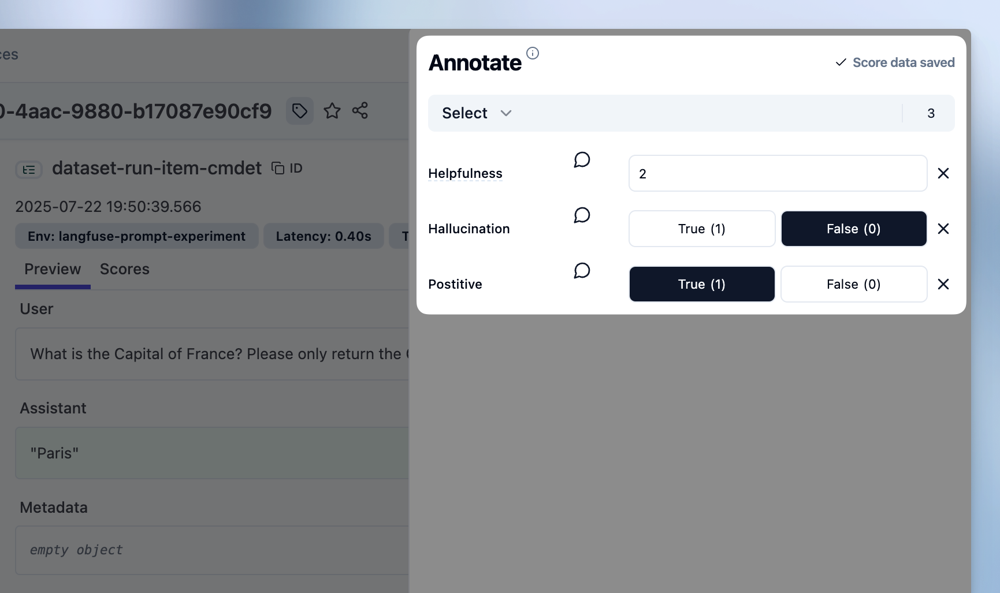
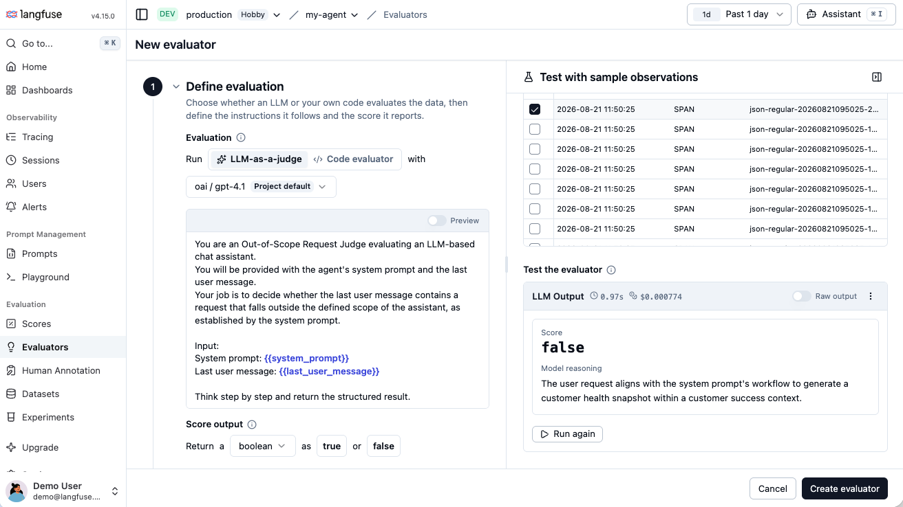

# 第 3 章 判定器设计

任务规格已经说明一次任务应该达到什么结果、执行过程中需要遵守哪些约束，以及判断这些要求时可以读取哪些证据。接下来要解决的是：**怎样根据这些证据判断任务是否通过。**

**判定器（`Grader`，也叫 `Evaluator`）**就是执行这种判断的逻辑。它按照预先定义的评分规则读取执行证据，并针对某项任务要求给出判定结果[1][4]。一个任务通常包含多种不同性质的要求，例如最终状态是否正确、关键操作是否符合规则、回复是否包含必要信息，因此通常需要多个判定器分别检查[1]。

判定器应当与任务规格中的要求和证据对应：每项需要验证的预期结果或行为约束，都应有相应的判定逻辑；判定过程中使用的证据，也必须已经在任务规格中声明。同时，评分规则应足够明确，使不同评审者或不同判定方法面对同一份证据时能够得到尽可能一致的结论。人工之间以及人工与自动判定之间的一致性，会在后面的校准环节进一步检查[13]。

本章最终把这些内容整理成一份判定器规格，用同一套标准持续比较不同版本的 Agent。

## 3.1 判定对象与结果

设计一个判定器之前，需要先确定两个基本问题：**它要检查什么证据，以及检查之后输出什么结果。**

### 3.1.1 判定对象

判定对象指**判定器实际读取和检查的证据**[1]。

根据一次 Agent 执行产生的信息，常见的判定对象包括：

- **最终状态**适合验证可以直接查证的结果，例如订单状态是否发生变化、数据库中是否写入正确记录、文件是否生成、测试是否通过。一个典型的例子是确认订单是否真的写入后台，而不能只根据 Agent 回复中的“操作成功”来判断[1]。

- **执行记录**适合检查无法从最终状态直接看出的过程行为，例如 Agent 使用了哪些工具、是否存在越权操作、是否收集了必要信息，以及关键决策是否符合要求。根据具体评分项，可以检查整段执行过程，也可以只检查其中某一次操作。

- **给用户的最终回复**主要用于检查用户最终拿到了什么信息，例如必要信息是否完整、处理结果有没有说明清楚，以及回复是否满足相应的表达要求。

一个任务可以针对不同判定对象分别设置判定器，同一份证据也可能被多个判定器使用。这反过来对任务设计提出了一个要求：新增一项检查之前，必须先确认执行过程中能够获得支持这项判断的证据。没有相应证据的要求，判定器无法实际验证[1][3]。

### 3.1.2 判定结果

判定结果（`Score`）是**判定器针对某个检查项给出的结果记录**。它通常包含结果名称、取值和数据类型，也可以附带说明或判定理由[6]。

常见的结果形式有四种：<u>文本、布尔值、类别和数值</u>。选择结果形式时，主要考虑两个问题：**结果是否需要直接参与统计，以及判断本身是离散还是连续。**

文本适合记录开放式的评审意见、问题说明和判定理由，可以保存难以直接量化的信息，也有助于从人工评审中进一步归纳新的评分项。由于自由文本难以直接聚合，因此通常不用于计算整体通过率或比较不同版本的分数[6]。

能够明确回答“是 / 否”的条件适合使用**布尔结果**，例如“是否包含违规内容”“格式是否合法”；存在有限几种预定义状态时，可以使用**类别结果**，例如“正确 / 部分正确 / 错误”；需要表达连续程度时，则使用**数值结果**，例如相关度或准确率。

数值评分尤其需要提前规定取值范围、数值增大的方向，以及不同区间分别对应什么质量水平。否则，同一个分数可能被不同评审者作出不同解释。对于本身可以清楚判断为通过或失败的条件，优先使用布尔结果通常更容易保持判定一致[12]。

为了让判定结果可以追溯，每条结果还需要与它所评估的执行对象关联。例如，它可以对应一次完整的端到端执行、其中某一次具体操作，或者一整段多轮会话[7]。这样查看一个分数时，可以继续找到产生这个分数的原始证据。

图注：一条执行记录上可以挂多个评分项，每项各自选用合适的结果形式，并附加文字说明。图片来自 [9]。

长期使用时，还需要固定同一评分项的基本定义。评分配置负责记录分数名称、数据类型和允许的取值范围，使同一种评分在不同任务和不同批次中保持一致[7]。否则，同一个名称的分数如果在不同批次采用不同范围或不同含义，就无法直接进行版本比较。

每条评分结果还可以记录它的来源，例如由程序接口写入、自动判定器产生，或者由人工评审给出[7]。来源信息使后续分析能够区分不同结果的产生方式，并为人工结果与自动结果之间的比较提供基础。

至此，一个判定器要检查什么、最终输出什么已经确定。一个任务通常会同时使用多个判定器，多个结果最终怎样组合成任务是否通过的结论，将在后面的评分规则中继续讨论。

## 3.2 评估方法框架

从执行证据得到判定结果，需要解决三个层面的问题：

- **判定机制**：由谁、以什么方式作出判断；
- **判定参照**：判断时依据什么标准；
- **评分记录与协作**：结果如何保存，以及人工和自动系统如何共同使用这些结果。

把三者分开后，同一套评分规则就不必绑定某一种实现。例如，“退款前是否获得用户确认”既可以由代码检查，也可以交给 LLM 或人工判断，而这条规则本身保持不变。

### 3.2.1 判定机制

判定机制是**直接产生评分结果的主体和逻辑**。不同机制主要区别在于能够处理什么类型的判断、是否能够给出解释，以及执行成本。

（1）**代码判定**使用确定性的程序规则检查证据[3]。它适合能够直接验证的事实，例如字符串或字段是否匹配、输出格式是否合法、某个工具是否调用、参数是否正确、数据库状态是否满足要求，以及测试是否通过。这类判定结果稳定、可重复，也比较容易定位问题。它的限制是检查规则必须提前写清楚；如果条件过于僵硬，例如要求固定措辞，或者要求 Agent 按照某个并非必要的工具顺序执行，就可能把实际有效的结果误判为失败[1]。

（2）**大语言模型判定（`LLM-as-a-Judge`，以下称 LLM 判定）**使用语言模型根据给定证据和评分规则作出判断，并可以同时生成判定理由[4]。它适合代码难以直接判断的开放式语义要求，例如回答是否完整、依据是否充分、沟通方式是否合适，或者执行过程中的决策是否合理。LLM 判定能够理解复杂的自然语言要求并给出理由，但结果会受到输出长度、候选顺序、判定模型和提示词等因素影响[11][12]。因此，正式使用前需要通过人工参考样本进行校准，具体方法会在 3.5 中讨论。

图注：一个大语言模型判定器由三部分构成：判定规则、输入映射和结果形式。配置完成后，应先在样本上试运行，再投入正式评测。图片来自 [4]。

（3）**Jev 判定**（`Jev-as-a-Judge`）同样使用模型作出判断，但不要求模型自由生成一段评分文本。调用前先定义类型化的问题和允许的答案，模型再根据提供的状态，从这些答案中选择结果并返回相应概率[5]。

例如，可以提前定义如下问题和候选答案：

> 退款前是否获得用户明确确认？  
> `Yes / No / Unknown`

这种方式把答案空间限制在预先定义的范围内，减少输出格式和措辞带来的波动，而且一次调用可以同时回答多个类型化问题，因此适合大批量的分类、等级和是非判断[5]。它仍然属于模型判定，问题定义、输入状态和候选类别都会影响结果。Jev 本身不能主动弃权，因此如果现实中存在无法判断的情况，需要提前设置“其他”或“不确定”等选项；提供给模型的状态也应只包含与当前判断有关的信息，以减少无关材料带来的干扰[5]。

（4）**人工评审**由领域人员按照评分规则直接检查执行证据，并给出判断和意见[8]。人工能够处理复杂的业务语义和专业判断，也可以为自动判定器提供参考标签。它的主要限制是速度慢、成本高，而且不同评审者之间也可能产生分歧。因此，人工评审主要用于风险较高、难以完全自动化的任务，评分规则尚未稳定的案例，以及为自动判定器建立参考标签和进行校准[8][12]。

### 3.2.2 判定参照

判定参照是**判定器比较证据时采用的标准**。它与判定机制相互独立：同一种参照可以由不同机制执行，例如同一套退款规则既可以写成代码，也可以交给 LLM 或人工检查。

（1）第一种是**评分规则**（`Rubric`）。

评分规则直接写明什么情况下通过、失败，或者达到某个等级。它适合没有唯一标准答案，或者一个任务需要同时检查多项要求的情况。

规则需要尽量明确。像“回答质量好”“处理得合理”这样的要求过于宽泛，不同的人或模型很容易给出不同理解。更合适的做法是把它继续拆成具体的检查项，例如“是否说明退款金额”“是否解释下一步操作”。

（2）第二种是**参考答案**。

这种方式把实际结果与预先准备的正确答案或预期结果比较[11]。它提供了明确的判断锚点，适合答案或目标状态比较确定的任务。

如果一个任务实际上存在多种同样有效的回答或执行路径，单一参考答案可能无法覆盖所有合理结果，因此参考答案通常需要与任务本身的开放程度相匹配。

（3）第三种是**成对比较**。

成对比较不要求直接给某个结果打绝对分，而是在同一套标准下同时查看两个候选结果，再判断哪个更符合要求[11]。

这种方式适合比较两个 Agent 版本或两个方案。当目标主要是比较相对质量时，它往往比直接要求模型给出开放式绝对评分更容易保持稳定[11][12]。

成对比较得到的是相对结论。它可以说明 A 与 B 相比哪个更符合评分规则，但不能单独证明其中任何一个已经达到正式发布要求。

这三种参照并不互斥。例如，可以先定义一套评分规则，同时提供参考答案作为判断依据；Jev 的类型化问题也可以看成一种约束较强的评分规则——候选答案和等级在调用前已经确定，模型负责从中选择[4][5]。

### 3.2.3 评分记录与协作

得到评分结果以后，还需要把不同来源的结果统一记录到对应的执行对象上，使这些结果能够被追溯、比较，并用于后续分析。

人工评分可以直接针对少量样本进行，也可以通过标注队列批量完成。**手工评分**适合少量样本的快速复核、单个问题排查，以及建立初始的人工参考结果[9]；当样本数量增加以后，可以使用**标注队列**，把一批执行记录集中起来，由领域人员按照同一套评分标准批量标注[8]。

另一类结果来自自动程序或外部系统。如果某个分数已经由应用程序、持续集成流水线或其他评估流程计算出来，可以通过 `API` 或软件开发工具包（`SDK`）写入评测系统[10]。`API` 或 `SDK` 只负责记录已经产生的结果，并不定义这个分数应当怎样计算。

无论结果来自人工还是自动系统，都应使用一致的评分定义，包括评分项名称、数据类型和允许取值，并关联到对应的执行记录。这样，同一个评分项下的不同结果才能直接比较，也能够追溯每个分数由谁、以什么方式产生。

统一记录也为后续校准提供了基础。例如，可以让人工和自动判定器对同一批样本分别评分，再检查两者的分歧。具体怎样衡量一致性、定位偏差和调整判定器，将在 3.5 中讨论。

## 3.3 方法选择与组合

方法选择应当**从成功条件、证据类型和所需结果倒推**。不同机制各有适用边界，可以按照下面的顺序选择。

1. 能从环境状态、工具参数或测试结果直接查证的条件，优先使用代码判定。这类条件可以写成确定规则，结果稳定、可重复。

2. 候选标签、等级或是非判断已经预先确定，并且样本量较大时，可以使用 Jev 判定。类型化问题能够在一次调用中回答多个判断，也可以返回概率供后续设置阈值。

3. 需要判断完整性、依据质量或沟通质量，并且希望获得书面理由时，可以使用 LLM 判定。它适合开放式语义条件，但正式使用前需要通过人工标签进行校准。

4. 依赖专业知识、风险较高，或者自动判定尚未与领域判断稳定对齐时，应保留人工评审。人工标签既提供领域参考，也为自动判定器的校准提供依据。

5. 如果分数已经由应用程序、流水线或持续集成（`CI`）作业计算完成，可以通过 `API` 或 `SDK` 写入同一套评分记录，与其他结果一起分析。

一个任务配置多个判定器时，可以按照条件和证据类型分工：可验证事实交给代码判定，类型化判断交给 Jev，开放式语义质量交给 LLM，高价值或高风险样本由人工评审建立参考标签[1][5][8]。一种常见的组合方式是：**所有样本先运行成本较低的类型化判定，再对其中一部分样本或被标记的样本补充 LLM 判定，人工标签则用于检查自动判定结果是否可信**[5]。这样可以把人工评审集中在校准、疑难样本和高风险任务上，而不必承担全部样本的判定工作。

## 3.4 评分规则

评分规则（`Rubric`）是**一组明确说明判定依据的检查项**。它的作用是把抽象的成功条件变成可以判断的事实或标准[13][1]。

### 3.4.1 评分项

一条评分项只负责**一个**事实或**一个**判断，例如是否完成身份验证，或者是否说明退款金额[1]。写评分项时需要交代四件事：判什么、看哪份证据、什么算通过、什么算失败。

证据不足时，评分项应当返回**未知**。未知表示现有材料既不足以判定通过，也不足以判定失败，它与失败是不同的结果[1]。保留“未知”还有一个实际作用：可以反过来检查规则和证据设计。未知比例偏高，通常说明评分规则不够清楚，或者证据采集不够完整[13]。

开放式质量要求需要进一步**拆成具体的评分项**。例如，可以把“这个回答好不好”拆成一组能够分别判断的问题。这样，原本模糊的整体感受会转化为更明确的事实依据，人与人之间、人与自动判定之间的分歧也更容易定位[13]。评分项可以使用布尔、类别或数值结果；评分粒度越清楚，人工评审和自动判定越容易得到可比较的结论[13][1]。

### 3.4.2 任务结论

一个任务通常包含多个评分项，单个评分项只能说明其中某一项要求是否满足。因此，还需要进一步把这些结果合成为**任务结论**，用于表示一次完整执行整体上是否成功。

合成之前，首先要区分这些评分项之间的关系：它们是在描述**同一个目标的不同侧面**，还是表示**需要分别满足的不同要求**。

- 如果多个评分项共同描述同一个质量目标，可以把它们组合起来衡量整体质量。例如，一份报告可以分别从覆盖度、准确性和结构等方面评分，再根据各项的重要程度计算综合结果。

- 如果评分项表示相互独立的要求，就需要进一步判断其中是否存在不能被其他分数抵消的硬性条件。例如，退款任务中的“是否完成退款”和“是否完成身份验证”分别对应任务完成和安全要求。身份验证一旦失败，即使其他评分项较高，也不应该通过加权把这一失败抵消。

根据这种关系，任务结论通常有三种合成方式：**必过规则、加权规则和混合规则**[1]。

- **必过规则（Hard Gate）**要求所有关键评分项都通过，只要其中一项失败，整个任务就判定失败。它适合安全、合规、权限控制和不可逆操作等硬性要求。
- **加权规则（Weighted Score）**为不同评分项分配权重，再根据综合分数是否达到阈值得到任务结论。它适合多个评分项共同描述一个质量目标，或者任务本身允许存在不同完成程度的情况。
- **混合规则（Hybrid）**同时使用前两种方式。例如，先要求权限和安全相关评分项全部通过，再根据完整性、效率等指标计算综合质量。

即使最终任务只输出“通过”或“失败”，也应保留有意义的部分得分。一个正确识别了问题、也验证了客户身份、只是没能完成退款的 Agent，明显好过一个一开始就失败的 Agent，两者的结果应当能区分开[1]。因此，任务级结论用于说明整体是否成功，而各个评分项和部分得分则进一步说明任务完成到了什么程度，以及失败发生在哪个环节。

任务结论还需要能够追溯到参与合成的评分项和对应证据。这样，当一次执行被判定为失败时，可以继续确定具体是哪项要求没有满足，而不是只得到一个无法解释的失败结果。

评分规则本身也会影响最终的任务结论，因此设计时应优先检查任务结果和真正重要的过程要求。只有当步骤顺序本身会影响正确性或安全性时，才需要把工具调用顺序写进评分规则[1]。如果把某个固定的工具调用序列直接作为要求，Agent 即使采用另一条同样有效的执行路径，也可能被误判为失败；这会使测试对合理的执行变化过于敏感[1]。

评分规则本身也可能配置错误。一种情况是判定器实际要求的门槛高于任务中明确给出的门槛，导致按照题目要求完成任务的 Agent 反而失分，而没有严格遵循题目目标的 Agent 可能得到更高分[1]。另一种情况是判定条件过于僵硬，例如任务结果已经满足 `96.12`，判定器却要求精确匹配 `96.124991…`，最终把合理结果判断为失败[1]。因此，任务结论是否可信，不仅取决于 Agent 的执行结果，也取决于评分规则是否准确反映了任务本身的要求。

## 3.5 校准与验证

校准和验证关注的是两个不同的问题。**校准**用人工标注的参考样本，检查自动判定结果是否稳定地贴近领域人员的判断；**验证**则检查判定器是否真的在测量任务规格中声明的条件，而没有把无关因素当成判断依据。前者关注“判得是否一致”，后者关注“判的是否是正确的东西”，两者共同决定判定结果是否可信[12][8]。

### 3.5.1 参考标注

参考标注是领域人员对一批有代表性的执行给出的判断，以及作出这些判断的理由[8]。它有两个主要用途：一是检查不同人工评审者之间的一致程度，二是衡量 LLM 判定与领域判断之间的差异[13][12]。

参考样本需要覆盖通过、失败、部分完成和证据不足四种情况。如果样本只覆盖一种结果，就无法判断评分规则和自动判定器在其他情况下是否仍然有效。

多位评审者必须使用同一套评分规则，并采用背靠背的方式独立标注（不能让后标的人看到前一个人的结论）。出现分歧时，可以从三个方向处理：修订评分项、补充示例，或者把证据要求写得更明确[13]。分歧本身也是有用的信号，因为它通常说明规则中还有没有说清楚的地方。

除了评审者之间是否一致，还可以观察**“未知”结果的比例**。“未知”不仅是一种判定结果，也能反映评分规则和证据设计的质量：未知比例偏高，通常说明评分项写得不够清楚，或者证据采集得不够完整[13]。

通过这些分歧和未知样本持续修订规则，直到单条评分项的一致程度达到事先设定的阈值，规则才算稳定。例如，可以把人与人之间的一致率设为 85%、人与机器之间设为 90%[13]。具体阈值需要在评测开始前确定，避免根据已经得到的结果反向调整标准。

### 3.5.2 判定器检查

有了参考标注之后，就可以在代表性样本上把自动判定结果与参考结果放在一起比较。检查可以分为四层，分别回答四个问题：**判定器有没有正常工作、结果是否与人工一致、判断依据是否正确，以及结果是否受到系统性偏置影响。**

第一层检查**判定器是否正常产出结果**。判定器报错或没有返回值，本身就是一种失败，不能作为“没有问题”直接跳过[7]。这类问题在批量运行时尤其容易被忽略，因为它通常表现为分数缺失，而不是分数偏低。

第二层检查**自动判定与参考标注的一致程度**。LLM 判定只有与专家结论达到足够的一致性，才适合进一步规模化使用[12][4]。标注样本可以从 20 条左右开始，再逐步增加，避免样本过少使校准结果受到个别案例影响[12]。

这里还需要注意，通用基准上的一致率不能直接代替具体业务中的校准结果。语言模型判定与人工的一致率在一些通用基准上可以超过 80%，接近人工标注者之间的一致程度；但到了领域特定的 Agent 任务中，这一水平可能明显下降。因此，校准必须使用自己业务中的参考样本，而不能直接采用通用基准上的数字[12]。

第三层检查**判定依据是否正确**。除了看最终结果是否一致，还需要结合判定理由和对应的执行记录，确认判定器确实使用了评分规则要求的证据。这一步主要防止判定器通过输出长度、格式等与实际质量无关的特征走捷径[11][12]。这种问题有时不会明显降低整体一致率，却可能使判定器在特定类型或边界样本上持续出错。

第四层检查**系统性偏置**。LLM 判定已知会受到几类因素影响：输出长度可能影响分数，候选项的排列顺序可能影响选择，提示词的改写也可能改变最终判断[11][12]。此外，把多项要求交给同一个判定器同时判断，也可能使不同评分项之间相互干扰。更稳妥的做法是先把要求拆成结构化评分项，再分别进行判断[1]。

因此，这一层检查的重点不是某一个样本有没有判错，而是判断结果是否会随着**长度、顺序、提示词或评分项组合方式**发生系统性的变化。

Jev 判定还需要额外检查三个方面：问题是否原子化，即一个问题只包含一个判断；输入状态是否只保留了必要证据；类别中是否提供了“不确定”等出口[5]。前两类要求分别约束问题和输入状态的设计，第三类则避免模型在证据不足时被迫从已有答案中选择。与问题无关的状态信息过多，也会降低判定准确率[5]。

完成初始校准并不意味着判定器可以永久保持不变。判定模型可能随着版本变化产生漂移，使同一份证据在不同时间得到不同结论，因此需要定期重新运行参考样本进行校准[12][5]。这种漂移不一定表现为分数突然变化，也可能只是判定标准逐渐变宽或变严。

因此，判定器本身也应当作为评测系统的一部分持续管理。Agent、业务规则或判定模型发生变化之后，都需要重新运行参考样本[12][5]。判定器本身发生修改时，还会带来另一个问题：新判定器产生的结果不能直接与旧判定器产生的历史结果比较。此时需要用新的判定器重新评估历史样本，使版本比较重新建立在同一套评分标准上[7]。否则，团队可能把判定器变化造成的分数差异误认为 Agent 本身发生了变化。

## 3.6 判定器规格

前面的设计最终需要整理成一份可以复查和复用的**判定器规格**。这份规格记录一个判定器怎样读取证据、按照什么规则作出判断，以及它的结果怎样进入最终的任务结论。

规格可以按照前面的设计顺序填写。首先写清楚**判定对象和证据来源**，说明这个判定器实际检查什么；然后说明采用哪种**判定机制**和**判定参照**，并附上真正执行判断的载体，例如检查代码、提示词、类型化问题，或者提供给人工评审者的说明。

接下来记录**评分结果怎样产生和保存**，包括评分项、每项采用的结果形式，以及人工或自动系统怎样参与。一个任务包含多个评分项时，还需要写明这些结果怎样合成为最终的任务结论。

最后记录**参考标注、校准结果和已知限制**。这些信息说明当前判定器经过了什么验证，以及它在什么条件下仍然可能产生不可靠的判断。

这份规格还必须与任务规格保持对应。任务规格中声明的每一项预期结果和行为约束，都应当有相应的判定器负责检查；判定器使用的每一项证据，也都应当已经在任务规格中声明。这样可以从任务要求一路追溯到判定逻辑和最终结果。

**已知限制不能省略。** 即使判定器已经完成校准，也不意味着它在所有样本上都同样可靠。记录它在哪些情况下容易出错、目前校准到了什么程度，可以在后续解释实验结果时区分 Agent 本身的变化和判定器带来的噪声。

下面以表格模板的形式展示上文所述的规格：

| 字段                 | 内容                                        |
| -------------------- | ------------------------------------------- |
| **判定器名称**       | 唯一名称，例如 `refund_confirmation_grader` |
| **对应任务要求**     | 该判定器验证的预期结果或行为约束            |
| **判定对象**         | 最终状态 / 执行记录 / 最终回复              |
| **证据来源**         | 实际读取的字段、状态、Trace 或回复内容      |
| **判定机制**         | 代码判定 / LLM 判定 / Jev 判定 / 人工评审   |
| **判定参照**         | Rubric / 参考答案 / 成对比较                |
| **评分项**           | 具体需要判断的事实或条件                    |
| **结果形式**         | Boolean / Category / Numeric / Text         |
| **通过条件**         | 什么情况下该评分项判定为通过                |
| **未知条件**         | 哪些情况下证据不足，返回 `Unknown`          |
| **任务结论中的作用** | 必过项 / 加权项 / 诊断项，以及对应权重      |
| **参考标注**         | 用于校准的人工标注样本及来源                |
| **校准结果**         | 人人一致率、人机一致率等验证结果            |
| **已知限制**         | 已知偏置、容易误判的情况或适用边界          |
| **版本**             | 判定器或评分规则版本                        |

## 参考文献

1. Anthropic. [Demystifying evals for AI agents](https://www.anthropic.com/engineering/demystifying-evals-for-ai-agents). `Types of graders for agents`、`Evaluating coding agents`、`Step 2: Write unambiguous tasks with reference solutions`、`Step 5: Design graders thoughtfully`。
2. Langfuse. [Core Concepts](https://langfuse.com/docs/evaluation/core-concepts). `Evaluation Methods`。
3. Langfuse. [Code evaluators](https://langfuse.com/docs/evaluation/evaluation-methods/code-evaluators)。
4. Langfuse. [LLM-as-a-Judge](https://langfuse.com/docs/evaluation/evaluation-methods/llm-as-a-judge)。
5. Langfuse. [Jev as a judge](https://langfuse.com/docs/evaluation/evaluation-methods/jev-as-a-judge)。
6. Langfuse. [Scores](https://langfuse.com/docs/evaluation/scores/overview)。
7. Langfuse. [Scores Data Model](https://langfuse.com/docs/evaluation/scores/data-model)。
8. Langfuse. [Annotation Queues](https://langfuse.com/docs/evaluation/evaluation-methods/annotation-queues)。
9. Langfuse. [Scores via UI](https://langfuse.com/docs/evaluation/evaluation-methods/scores-via-ui)。
10. Langfuse. [Scores via API/SDK](https://langfuse.com/docs/evaluation/evaluation-methods/scores-via-sdk)。
11. OpenAI. [Evaluation best practices](https://developers.openai.com/api/docs/guides/evaluation-best-practices?api-mode=responses). `LLM-as-a-judge and model graders`。
12. LangChain. [Evaluating AI Agents at the Run, Trace, and Thread Level](https://www.langchain.com/resources/agent-evals). `Calibrating the judges`、`Human review that scales`。
13. 美团技术团队。[Agent 评测漫谈——由浅入深讲解 Agent 评测](https://tech.meituan.com/2026/08/07/Agent-Evaluation.html). `2.3 使用“人人一致、人机一致”的方法论对齐主观评测`、`2.4 Agent 评测是一门实践科学`。
