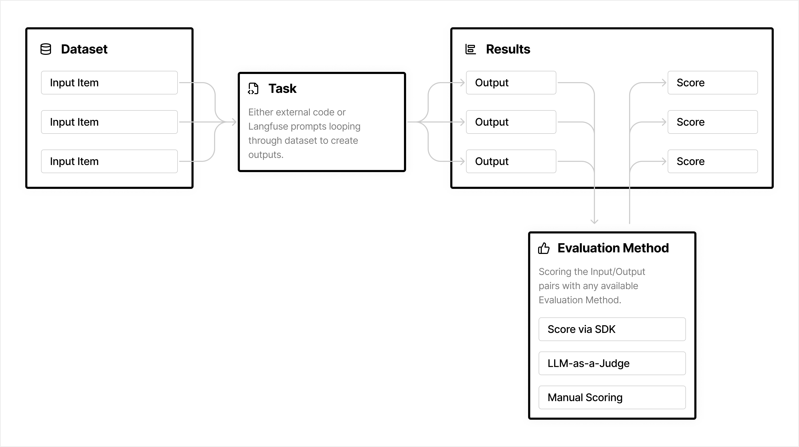
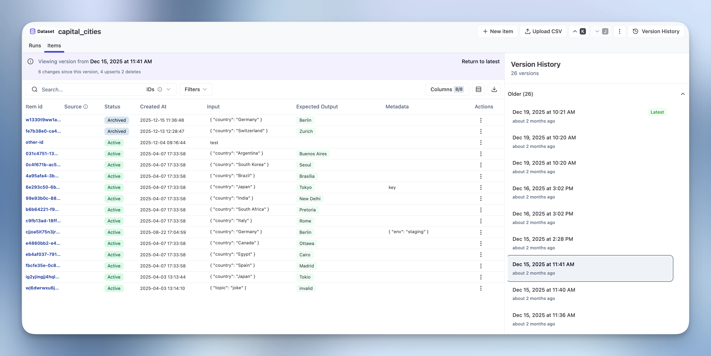
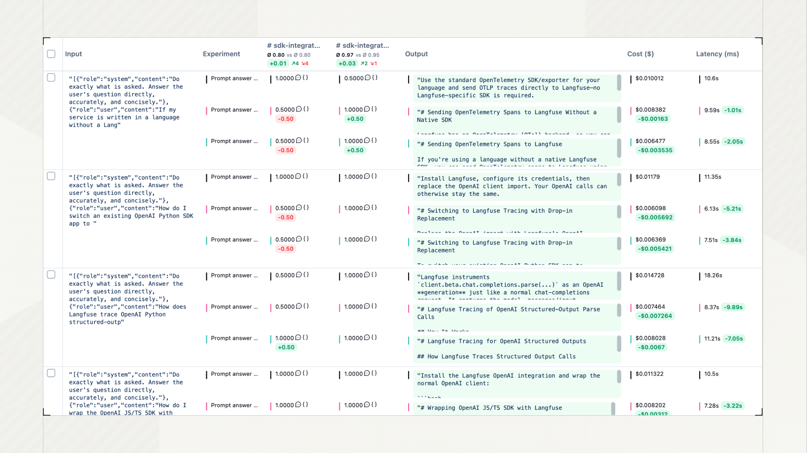

# 第 4 章 组织测评集并解读实验结果

前三章的产出连起来能跑出分数：成功标准定义了要什么，任务规格固定了怎么测，判定器给出了结论。但一个分数本身说明不了“这个版本能不能发”。发布问题需要两样东西：分数可比，以及可比的结果能落回具体任务。

要建立的判断有三层。第一层是可比性：一次比较要固定住什么，分数变化才能归因到候选变更。第二层是随机性：单次结果不足以代表稳定表现，要用多次试验和对应指标来描述。第三层是个案：汇总分数会掩盖关键失败，发布判断必须回到具体任务和失败记录。

三层判断之外还有一块管不到的地方：测评集尚未覆盖的真实使用问题，留到第 5 章。

## 4.1 测评集与实验

四个对象的含义和关系要先固定下来。

测评集（`Evaluation Suite`）是为测量特定能力或行为而组织的一组任务，它表达测量目的[1]。数据集（`Dataset`）是任务输入、可选预期结果和元数据的存储载体[3][4]。两者职责不同：测评集回答“我要测什么”，数据集回答“这些任务的数据存在哪里、怎么改”。同一个测评集可以落在一个数据集上，也可以分散在多个数据集里。

本文用“测评集”指代测量目的，用“数据集”指代可版本化的任务数据。这个区分在固定配置时会显出用处：测量目的靠文档和约定固定，任务数据靠版本号固定。

实验（`Experiment`）是在固定配置下，让一个 Agent 版本跑一遍测评集并可由判定器评分的过程[4]。一次实验运行（`Experiment Run`）覆盖选定的全部数据项。运行过程中，每个数据项产生一条执行记录和对应输出；只有挂上判定器，这些输出才转成评分结果[4]。

图注：数据集提供输入，Task 产生输出，判定方法再把输入输出对变成分数。图片来自 [4]。

四个对象串成的顺序是：测评集确定测量范围，数据集快照固定任务数据，实验运行生成执行证据，判定器按需生成评分。这个顺序有一处非对称：输入侧（测评集、数据集）由团队完全控制，输出侧（执行证据、评分）只能记录和观察。所以可比性只能靠固定输入侧来换。

## 4.2 测评集分类

测评集可以按用途分，也可以按测量范围分。两种分类互不排斥，一个过程测评集既可以用来衡量新能力，也可以用来做回归保护。

### 4.2.1 用途

按用途分，测评集有能力和回归两种[1]。两者常被当成两个并列的定义，实际是同一条能力演进路径的两端。

能力测评集用来衡量 Agent 尚未稳定解决的困难任务。它问的是“这个 Agent 现在能做好什么”，因此起步阶段的通过率应当偏低。这里的低是设计目标而不是缺陷：只有任务难到 Agent 做不好，集合才留出改进空间，团队才有一个要爬的坡[1]。

回归测评集用来检查 Agent 是否仍能完成已经验证的任务。它问的是“以前会做的是不是还会做”，因此通过率应当接近 100%。这里分数下滑不需要再问原因，它本身就说明有东西坏了[1]。

两类集合的分数特征相反，所以必须分开维护。混在一起的后果是可解释性丢失：整体通过率上升，可能只是回归集里混进了简单任务，而不是能力真的提升。

两者之间有明确的转移动线。一个能力任务稳定解决之后，它作为能力信号的价值就消失了，此时把它转进回归测评集：它测量的命题从“我们到底能不能做到”变成“我们还能不能稳定做到”[1]。这也解释了为什么能力测评集需要持续补充：全部任务都稳定通过之后，这个集合只剩下回归信号，不再指出下一步该攻哪里[1]。

两类集合还要同时跑。团队在能力集上爬坡时，改动很容易在别处造成退化，回归集就是用来接住这种退化的[1]。

### 4.2.2 测量范围

按测量范围分，测评集有端到端和过程两种。这两种的差别不在粒度大小，它们回答两个不同的问题：端到端回答“事有没有办成”，过程回答“中间哪一步出了问题”[2]。

端到端测评集站在用户视角，判定对象是用户目标有没有完成，以及最终状态或最终回复是否满足要求。它给出的数字是业务方最关心的那一个。它的局限是定位能力弱：结果下降时，它无法独立说明是执行过程的哪一步出了问题[2]。

过程测评集判定关键工具调用、检索、决策或子任务的执行记录。它的价值只有在配合端到端时才完全显现。一个具体的诊断过程是这样的。端到端交付率是“100 个任务里 68 个交付了可用结果”。这个数字从 68 掉到 55 时，端到端集合无法说明原因。此时看过程指标：如果“取数环节调用成功率”从 95% 掉到 70%，问题就定位到了；如果调用成功率没变、但“数据合并正确率”下降，问题就在另一处[2]。

这个过程还留下一条反向的判读规则，它比正向定位更有用：**如果过程指标全都没波动，端到端结果却掉了**，那说明这次的失败来自测评集还没覆盖的地方，不是已知环节退化，此时应当去挖掘新案例并补充测评集，而不是继续盯旧指标[2]。

一句经验性的总结把两者的分工说得很清楚：端到端回答“要不要拉响警报”，过程回答“警报响了该找谁”[2]。缺少任何一方都会卡住：只有端到端，团队知道坏了但不知道哪坏了；只有过程，团队会遇到每个模块都达标、用户仍然不满意。

过程测评集需要继续往下拆，拆解单位通常跟着被测对象的模块走：知识库相关的问题归入知识库测评集，具体工具调用相关的问题归入工具测评集[2]。拆解有一个额外收益：当过程集合和团队分工对应起来后，某一层的分数下降可以直接找到负责的人[2]。

拆解也要有边界。分层拆解是问题倒逼出来的结果，不是设计的起点。正确的顺序是先建端到端集合和核心模块的过程集合，跑起来之后遇到“知道坏了但不知道哪坏了”的情况再往下细拆[2]。先建一套精细的层级，多半会在真正的问题出现时发现拆错了地方。

### 4.2.3 任务覆盖

测评集的内容决定它能发现什么问题。三条要求分别管来源、方向和成熟度。

来源上，初始测评集优先收三类任务：上线前人工做过的那几项检查、真实用户踩过的失败，以及影响面大的任务。早期从少量任务开始即可，等产品和任务理解稳定之后再扩展[1][6]。这三类的共同点是都在指向真实风险，而不是在补全题型。任务数量本身服务于决策：早期每个改动带来的影响都很明显，少量任务就足以看出效果，因此起步阶段把精力放在覆盖主要风险上，比先把题量堆起来更有效[1]。

方向上，同一个行为要有正例也要有反例：该发生的任务和不该发生的任务都得放进测评集。只测一个方向会得到单向优化的 Agent。一个具体教训来自搜索行为的设计：只测“该搜索时有没有搜索”，最后会得到一个对几乎所有问题都去搜索的 Agent，因为测评只在一侧给了反馈[1][6]。反例的作用就是按住这种过度执行。

成熟度上，任务数据的来源有三条路：人工编写、从生产记录里挑、以及合成样本[5][3]。三条路的成熟度不同：生产记录天然贴近真实输入，但记录下来的失败案例**不能直接入库**，它只有一段真实输入，还缺任务规格和预期结果，补全之后才能变成可回归的任务[5]。合成样本的成本最低，适合补上线上还没出现、但业务判断会出现的类型，代价是它是否真实还需要另行验证。

## 4.3 实验控制

受控实验只比较指定的 Agent 变更，其他会影响结果的条件保持一致。这是比较能成立的前提：只有控制住变量，版本之间的分数差异才可以归因到候选变更上[2][7]。

### 4.3.1 固定配置

每次用于版本比较的实验，至少要在四个位置记录并固定配置。任务这一侧记数据集版本和任务标识。Agent 这一侧记提交版本、模型、提示词、工具和运行参数。判定这一侧记判定器定义、评分规则和判定器版本。环境这一侧记执行环境、环境数据和依赖版本，再加上试验次数、并发和超时等运行设置[3][7]。

这四组配置里，数据集版本是唯一能提供“时间旅行”能力的一组。数据集条目的每一次新增、修改、删除或归档都会生成一个新版本，版本以时间戳区分，可以按指定时间点取回当时的条目集合[3]。

图注：每次条目变更都会生成新版本，按时间点可取回当时的条目集合。图片来自 [3]。

这条机制解决的是一个很实际的问题：测评集是活的，团队会不断往里加任务、改预期结果、归档过时条目。如果比较两个版本时用的是“当前最新”的数据集，那么两次实验用的其实不是同一批任务，分数差异里就混进了任务本身的变化。记下版本时间戳，取回的就是同一批数据，历史实验才可复现[3]。

固定数据集版本只解决数据一致，它消除不了 Agent 输出的随机性。因此还有一条硬要求：基线和候选必须使用同一数据集版本和同一套判定器定义，直接比较才成立[3][7]。

### 4.3.2 执行环境

执行环境要接近生产，并且为每次试验提供干净、相互隔离的初始状态[1][2]。

环境是最容易被破坏的那一项。典型破坏方式是执行环境与生产不一致：测试环境调用的下游接口数据和生产不同，或者沙箱里没有预置用户的历史文件，导致 Agent 拿不到必要上下文[2]。这类差异的危害不在分数偏高或偏低，而在让离线分数和线上表现系统性偏离。后果比一次测错更严重：团队会逐渐不再信任离线测评，转而依赖临场判断[2]。

隔离不足另有一层危害。残留文件、缓存数据和共享资源会引入与 Agent 能力无关的失败，让多个本应独立的试验因为同一个基础设施原因一起失败；它也可能反向虚增通过率[1]。

环境保真度有一个可操作的检验方法：拿同一批样本，分别在离线环境和线上影子流量里各跑一遍，看两边结论是否一致。差异过大就说明保真度不够[2]。这个检验同时覆盖了“环境是否像生产”和“环境是否稳定”两个问题。

环境数据和业务规则发生变化后，要重新确认任务是否仍可完成、判定器是否仍有效，并记录新的环境版本[1][2]。环境变更为什么必须当作版本事件，理由和数据集一样：它会让此前所有结论的适用前提失效，而且这种失效是静默的，旧分数不会自己变红。

### 4.3.3 实验记录

实验记录至少要关联五项内容：数据项、执行记录、最终状态、各项评分，以及 Agent 配置和成本、延迟等运行信息。成本记录一次运行消耗的资源，延迟记录从任务启动到完成的耗时[4][7]。

记录是否合格，可以用一个动作检验：从汇总分数出发，能不能一路点到具体任务、具体试验和具体判定依据。点得到，说明记录支撑得住个案复核；点不到，说明中间缺了一环，届时只能看着一个掉下去的分数猜原因。

## 4.4 重复试验与汇总指标

重复试验（`Trial`）是同一任务在相同配置下的一次独立执行[1][2]。需要它的原因很直接：Agent 输出带随机性，单次通过或失败不足以代表任务的稳定表现。

选择指标之前要先分清两个问题。第一个是“一个任务跑很多次，怎么描述它的表现”，这由单任务成功率回答。第二个是“整个测评集汇总成一个什么数字”，`pass@k` 和 `pass^k` 的分歧就在这里。两者容易混用，但回答的问题相反。

单任务成功率是同一任务在多次试验中通过次数占试验次数的比例。它的适用范围只到单个任务，用来识别不稳定或特别困难的具体任务，不能代表整个测评集的水平。

`pass^1`（等于 `pass@1`）是每个任务只看一次试验是否成功，再在测评集上汇总。它用来比较一次尝试的平均任务成功水平，是 `k = 1` 时的基准指标，说明不了多次执行的一致性。

`pass@k` 是对每个任务运行 k 次，至少有一次成功的概率，再对任务汇总。它适用于允许多次尝试、且任意一个可用结果就满足需求的场景。k 增大时这个指标通常上升，因为它描述的是“多试几次能不能撞上一次成功”[1]。

`pass^k` 是对每个任务运行 k 次，全部成功的概率，再对任务汇总。它适用于面向用户、每次都应稳定完成的任务。k 增大时这个指标通常下降，因为它描述的是可靠性和一致性[1]。同一个语义任务在多次试验中能否保持一致，就是用这个指标表达的[8]。

两个指标指向相反，所以**指标选择要服从产品要求，不能看哪个数字好看**。允许候选方案或重试的任务关注 `pass@k`，因为多试几次得到可用结果就是可接受的；一次失败就会影响用户的任务关注 `pass^k`，因为用户不会给第二次机会[1][8]。选错指标会把结论引向反面：一个用 `pass@k` 衡量很漂亮的版本，在 `pass^k` 下可能远达不到面向用户的要求。

这里有一处实现上的限制。按数据项组织的实验通常假定每个数据项只跑一次，也就是默认没有重复试验[4]。要得到 k 次试验，实际做法是让同一批数据项跑 k 轮，或者把重复放在实验之外的运行环节，再把结果按任务聚合。指标的计算方式不变，但记录结构必须能区分同一任务的不同试验，否则聚合时无法还原每个任务的成功次数。

## 4.5 版本比较与结果复核

版本比较以经过审阅的发布版本为基线，以待评估版本为候选[7]。比较之前先确认三件事：两者使用相同的数据集版本、相同的判定器定义，以及相同的必需任务集，并在元数据里记录 Agent 与判定器版本[7]。

### 4.5.1 汇总结果

汇总结果用来识别整体变化，包括任务通过率、规则得分、成本和延迟[7][9]。看汇总结果有三条纪律。

第一条，平均质量上升仍要检查关键任务是否出现新失败。平均值会掩盖个案，具体例子如下。

第二条，缺失任务、任务执行失败和判定器无结果都不能按通过处理[7][9]。这三种情况在统计上很容易被算成“没有失败”，但它们其实是信息缺失。把信息缺失当成通过，等于用不知道换来了一个好看的数字。

第三条，先确认判定器本身没出错。如果某条评分是判定器报错或没有返回，要先解决它，比较才算完整；同时要拿评分说明和实际输出对一遍，确认分数解释得通[7]。

平均值的掩盖效应可以用一组具体数字说明[7]。假设基线和候选的整体准确率都是 50%，看起来完全一样。但逐条看会发现：标准退款政策这一条基线通过、候选失败，促销商品退款政策这一条基线失败、候选通过。两边通过数相同，含义却完全相反：候选在一个关键场景上退化了，同时在另一个场景上修好了。只看平均分，团队下不了“能不能发”的判断。

图注：逐条对比把分数变化、输出内容、成本和延迟放在一起，新增失败和新增通过都能被看见。图片来自 [7]。

### 4.5.2 个案复核

对新增失败、关键任务和异常得分，要比对基线与候选的输出和执行记录[1][7]。复核分三步。

第一步是打开失败项的执行记录，看产生这个输出的中间环节，例如检索到的内容、模型调用和工具调用。一个错误的退款时限可能来自过时的政策文本，也可能来自模型没有采纳正确的政策，两者的修法完全不同[7]。

第二步是区分失败的性质。三种可能必须分开：Agent 执行失败、任务或环境问题、判定器误判[1][7]。判定器误判有很典型的形态，例如一个合理的改写没能通过字符串匹配，或者一段通顺的回答其实包含没有依据的说法[7]。把判定器误判当成 Agent 失败，团队会去修一个本来没坏的东西，而且修不好。

第三步是保证复核前后可比。如果复核过程中修改了判定器，必须用同一份新定义把两个版本重新评一遍，并保留原来的实验元数据，让这次决定可以复现[7]。

## 4.6 发布门槛

发布门槛（`Release Policy`）是把实验结果映射成发布或阻断决定的规则。它必须在解释结果之前确定，并与测评集里的任务优先级对应[7][9]。顺序不能倒：先看结果再定门槛，等于让结论去挑标准。

门槛有三种常见形态[9]。

必过门槛要求每个必需任务都满足绝对质量要求。安全、合规、数据准确性和不可逆操作适合用它。

回归门槛要求已在批准基线中通过的任务，在候选版本中仍然通过。它保护已验证能力，允许改进，不允许倒退。

组合门槛同时要求关键任务通过、已批准任务不倒退，并满足整体分数、成本或延迟阈值。它适合既有底线要求又有性能取舍的场景。

门槛还可以再分层。安全类和数据准确性类的检查项设为一票否决，任何一条不过就阻断发布；体验类和加分项则设阈值[2]。这与必过规则和加权规则是同一套思路，只是作用在发布判断这一层。

门槛要真正起作用，还需要两样东西配合。

第一样是批准基线。批准基线应显式记录数据集版本、判定器版本和每个任务的结论。候选运行即使整体通过，也不能自动替代批准基线[7][9]。基线文件本质上是一份经过评审的产物：它由一次完整运行生成，人工审阅过输出，再走正常的代码评审修改，绝不由被测候选自动生成[9]。这条限制针对的是一种很自然的偷懒：让每次通过的新版本自动成为新基线。它的问题不在标准被调低，而在于已知失败会因此失去痕迹。基线里记着每个任务的通过结论，候选即使带着尚未修复的失败也能通过整体比较，那些失败就再也不会在后续比较中出现[9]。

第二样是流程接入。把门槛接进持续集成与持续交付（`CI/CD`）或发布流程之后，离线测评才能在每次变更时稳定执行。没有接入流程的门禁，本质上只是一个建议[2][9]。

至此形成三样可复用的东西：一组用于版本比较的测评任务，一份固定的配置记录，以及一套事先写好的发布规则。第 5 章处理这套东西覆盖不到的部分，也就是线上真实使用中出现的新问题。

## 参考文献

1. Anthropic. [Demystifying evals for AI agents](https://www.anthropic.com/engineering/demystifying-evals-for-ai-agents). `Capability vs. regression evals`、`How to think about non-determinism in evaluations for agents`、`Step 3: Build balanced problem sets`、`Step 4: Build a robust eval harness with a stable environment`。
2. 美团技术团队。[《Agent 评测白皮书》系列 01：Agent 评测全览](https://tech.meituan.com/2026/09/10/Agent-Evaluation-White-Paper-01.html). `二、离线评测：变更的门控`、`2.1.2 评测集的分类：端到端与过程`、`2.1.3 评测集的分层拆解`、`2.2 回测执行：把评测集用起来`。
3. Langfuse. [Datasets](https://langfuse.com/docs/evaluation/experiments/datasets). `Why use datasets?`、`Versioning`。
4. Langfuse. [Experiments Data Model](https://langfuse.com/docs/evaluation/experiments/data-model). `Objects`、`End to End Data Relations`。
5. OpenAI. [Evaluation best practices](https://developers.openai.com/api/docs/guides/evaluation-best-practices?api-mode=responses). `Design your eval process`、`Handle edge cases`。
6. OpenAI. [Testing Agent Skills Systematically with Evals](https://developers.openai.com/blog/eval-skills). `4. Use a small, targeted prompt set to catch regressions early`。
7. Langfuse. [Compare experiments](https://langfuse.com/docs/evaluation/experiments/compare-experiments). `Choose comparable runs`、`Inspect scores and outputs`、`Investigate and review failures`、`Turn the decision into a CI policy`。
8. Sierra. [τ-bench: benchmarking AI agents for the real-world](https://sierra.ai/resources/research/tau-bench)（论文《τ-bench: A Benchmark for Tool-Agent-User Interaction in Real-World Domains》，arXiv:2406.12045v1）。`3 τ-bench`。
9. Langfuse. [Experiments in CI/CD](https://langfuse.com/docs/evaluation/experiments/experiments-ci-cd). `Choose your release policy`、`Compare against an approved baseline`。
