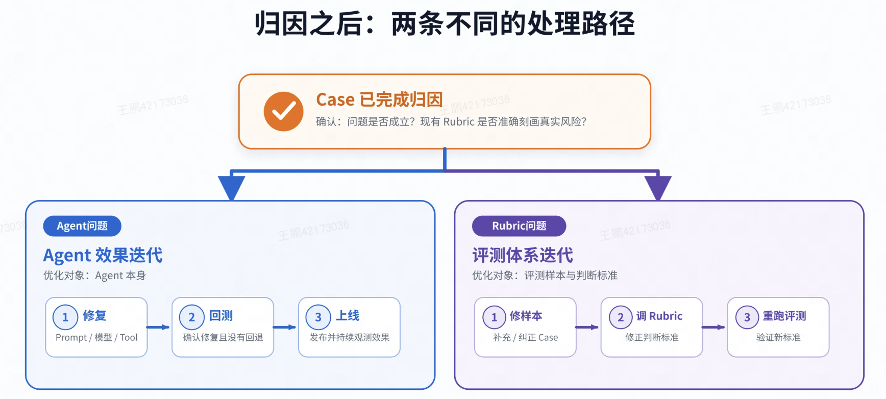
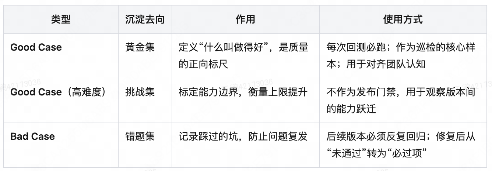

# 第 5 章 生产反馈与测评集演进

离线测评集只能覆盖它已经写下的场景，集合里没有的任务，回测永远测不出来[2]。用户开始集中提一类新需求时，离线集合不会自己长出对应的任务，而这类需求往往正是 Agent 走向规模化时最先暴露的短板。生产环境因此不只是验证场地，它是测评任务的主要来源。

从生产记录到测评任务的完整转化链有四步：先观察线上质量，再从生产记录里挑出样本，确认它是不是真问题并找出原因，然后把有效案例改写成可独立运行、可重复判定的离线任务，最后维护这个不断变大的任务集合。这条链跑通之后，任务、判定器和实验就不再是一次性检查，而是一个持续更新的循环。

## 5.1 线上质量观察

线上质量观察是在生产执行记录上持续收集质量和运行信号的活动。它包含三种手段，三者面对同一批记录，但看到的层面不同。

在线评测让判定器对实时产生的执行记录评分。它看的层面是**系统工作得好不好**，主要信号是质量、安全性、行为合理性和新出现的失败模式。在线监控盯的是运行指标，看的层面是**系统有没有在正常工作**，主要信号是工具调用的成功率、失败率、超时率、Token 消耗和任务类型分布。

两个层面必须分开看，因为一个层面正常不代表另一个层面正常。工具调用成功率 100%，但每次都返回了错误的数据，监控是绿的，评测是红的[2]。反过来也一样：输出质量看着没降，但超时率已经翻倍，成本正在失控。

在线监控的指标分三类，各有各的用途。可用性类包括工具调用成功率、失败率和超时率；成本类包括 Token 消耗、单任务平均步数和平均耗时；行为监控类包括任务类型分布、工具调用频次分布和平均对话轮次[2]。第三类的价值最容易被低估，它管的是用户结构的变化，而不是单次异常。某一类新任务的占比快速上升，通常意味着测评集的覆盖范围已经落后于真实需求，需要扩充了[2]。

三类指标要放在一起看，才能得出有意义的结论。任务完成率下降 5 个百分点，如果同时观察到某个工具调用的失败率从 2% 涨到 15%，结论大概率是工程问题；如果工具指标都正常，但某一类新任务的占比从 10% 涨到 35%，结论就是用户结构变了、Agent 在新场景上能力不足。这两种情况的应对完全不同：前者去修工具，后者去补测评集和补能力[2]。

巡检处在在线评测和在线监控的交集上，作用是把线上质量观察变成可追踪的过程。常见做法是从离线测评集里抽一批有代表性的任务，周期性地跑在线上 Agent 上；随着测评精细化，也可以单独维护一套巡检测评集[2]。它同时提供两种产出：作为质量判断，它看某类能力是否持续稳定，例如关键任务成功率是否低于预期；作为信号产出，它把分数变化、失败样本和异常趋势记录下来，交给后续的案例分析[2]。

在线评测有一条先天限制：它通常拿不到离线任务里那份完整的参考答案。这决定了它的能力边界。它适合发现质量模式、风险和漂移，但不能独立证明所有输出在事实上都是对的[1][2]。这条限制也解释了为什么线上结论必须回到离线去固化：只有在离线环境里补上参考答案和判定规则，一次线上观察才能变成可以反复验证的证据。

## 5.2 生产样本采集

生产案例（`Case`）是从真实执行记录中选出的、可供评审和后续测评使用的样本。一个案例要能用，前提是它带着完整的现场信息：原始输入、输出、执行记录、环境或版本标识，以及已经产生的用户反馈和自动评分[3][4]。缺了环境的案例无法重建，缺了版本标识的案例无法判断它对应哪一版 Agent。

### 5.2.1 采集来源

案例有四条来源，它们的差别不在产量，而在**盲区**[2]。这一点决定了四条路不能互相替代。

用户反馈的信号最强、最贴近用户的真实感受，因为它是用户主动说出来的。盲区是只有不满到愿意反馈的用户才会说话，因此样本量少而且有偏[2]。

自动判定和告警从低分、规则违反、质量下降和异常趋势里捞样本。它自动化程度高、时效性好，但只能发现已经被判定器或指标刻画过的风险，也就是“可量化的异常”[2]。

业务规则筛选按高风险或高价值条件挑样本，例如所有涉及资金、优惠券配置或批量修改的任务。它精准，针对的是已经识别出的风险点，覆盖范围因此受限于业务方对风险的既有判断[2]。

随机采样从线上真实请求里随机抽取，检查 Agent 在自然流量下的表现。它没有偏向，是发现“自己根本没想到的问题”的唯一手段。代价是成本最高、命中率最低[2]。

四条路的关系可以概括为一句话：反馈、监控和规则筛选各自只能看到自己那一侧的问题，随机采样负责覆盖剩下的一切。随机采样最贵又最不划算，因此最容易被砍掉，而它恰恰不可省略。砍掉它，团队就只剩已知问题在被反复发现[2]。

### 5.2.2 采样规则

采样规则规定哪些生产执行记录进入评审。规则要写清四件事：目标对象、过滤条件、采样比例，以及挂哪些判定器和人工复核条件[3][5]。这条规则同时决定在线评测的覆盖范围、成本和可解释性，因此它本身就是一项需要评审的设计。

规则里有两处取舍。

第一处是把监控信号和采集绑起来。一种具体做法是：监控里出现偏离信号，例如某个工具调用失败率突然升高，就把这一批失败记录拉进案例池[2]。这样做的理由是信号本身已经指出了异常位置，采样成本比盲抽低得多，而且能保证随机采样不会漏掉高风险场景。

第二处是采样比例。语言模型判定器的调用要花钱，比例定高了成本会失控，定低了又会漏掉问题。可行的做法是先看过去一段时间里规则命中的实际数量，再结合估算的调用成本调整比例[3]。顺序是先量命中量、再定比例，反过来做只能靠猜。

## 5.3 案例确认与归因

采集进来的样本还不能说明什么。一个生产案例要先判断它是好是坏，再判断问题出在哪。两步都完成，案例才能送到该去的地方[1][2]。

### 5.3.1 正向案例与负向案例

正向案例（`Good Case`）是达到预期质量的生产样本，它记录可接受的结果和行为。负向案例（`Bad Case`）是违反成功条件、暴露风险或触发用户负反馈的生产样本[6][2]。

两类案例的作用不对称。负向案例的价值最直接，它最容易暴露能力边界和系统短板，逻辑也很朴素：每一个曾经犯过的错，都不应该再犯第二次[2][6]。正向案例的价值反而常被低估。负向案例只说明哪里不行，不能说明到什么程度才算行；没有一批正向样本，团队讨论质量时只能各说各话，而有了它，“我们要做到这个水平”就变成了一个可以指着看的具体样本[2]。

负向案例的形态比“答错了”更细，通常是一组可辨认的失效模式。一组具体例子如下[4]。

- 把管理层叙述当成官方指标，而结构化导出数据并不支持。
- 把未经验证的指标当作财务已确认的数字报出去。
- 把母公司口径的集中度合并成一个更弱的法人实体口径。
- 在证据只支持某一类合规结论时，宣称更完整的合规状态。
- 产出一份漂亮的答案，却没有补齐引用、风险清单或证据材料。

这几种失败的共同点是外表完整、内部有缺口，单看最终回复很难发现。

人工评审要优先处理三类案例：高风险案例、用户明确投诉的案例，以及自动判定结论不确定的案例[1][5]。评审的产出有两个用途，不能只用一个：修正后的输出可以作为参考标签，评审意见可以用来校准自动判定器[1][5]。把评审只用来打分，就浪费了它最能拉高自动判定质量的那部分信息。

### 5.3.2 归因范围

归因的目标是从“这里出了问题”走到“为什么出问题”。一个负向案例本身只能说明有地方不对。做法是把 Agent 的执行过程铺开，沿着执行记录逐层定位问题点。这个过程和软件排查故障时看日志查错高度相似，因此高度依赖观测基建，执行记录不全就无法归因。这一步可以由人工完成，也可以由机器辅助[2]。

归因要先确定问题落在哪一层。按执行顺序可分六层，每一层的典型表现、修复动作和负责方都不同[2]。

| 层级 | 典型表现 | 修复动作 | 负责方 |
| --- | --- | --- | --- |
| 意图理解 | 用户要的是环比，Agent 做成了同比 | 调整提示词、补充示例、修改澄清追问策略 | Agent 研发 |
| 规划与路由 | 该调两个工具只调了一个，步骤顺序颠倒 | 优化任务拆解策略、修正工具描述 | Agent 研发 |
| 工具执行 | 工具参数传错，返回数据解析失败 | 修工具实现、补充参数校验 | 工具开发者 |
| 上下文与记忆 | 长任务之后忘了用户最初的约束条件 | 优化上下文压缩策略、引入结构化状态 | Agent 研发 |
| 知识与数据 | 指标口径理解错误，检索到过期文档 | 更新知识库、修正检索策略 | 知识运营 |
| 基座模型能力 | 复杂推理确实做不对，换模型后问题消失 | 升级模型、任务降维、引入专家知识 | 算法 |

这张分层表有两点。第一，六个层级对应六个不同的负责方，归因准确才能把问题派给对的人，否则会先开一轮会讨论“这是谁的问题”[2]。第二，最后一层才是真正的模型能力问题，前面五层都不是。把前五层的问题当成模型不行，最常见的后果是让团队去等一个并不解决问题的模型升级。

归因的结论还可能指向判定体系本身[2]。一支团队如果默认“评测说不行就是 Agent 不行”，会带来一个隐蔽问题：Agent 会被优化成迎合评测标准，而不是解决用户问题。评测标准本身有偏差时，优化越努力，离真实需求越远。因此归因要顺带回答两个问题：这个问题是否成立，以及现有的评分规则是否准确刻画了真实风险。

有一种失败模式在规模化之后才显现，需要单独处理。大量用户反复撞上同一条过时的护栏，这些执行记录分散在成千上万条互不相关的记录里，靠人工翻看根本看不出规律。把相似的执行记录聚到一起之后，同一类问题才会呈现成一个可辨认的模式，团队才能识别它并推动修复；没有这种聚合，这个失败模式会一直埋在生产数据里[5]。这也说明案例挖掘不能只依赖对单条案例的价值判断，还需要有把散落案例归成模式的机制。

归因完成后，案例会分到两条不同的处理路径[2]。

图注：同一个案例可能通向两条不同的迭代路径，先判断问题出在 Agent 还是判定标准。图片来自 [2]。

第一条是 Agent 效果迭代，优化对象是 Agent 本身，动作顺序是修复、回测、上线。第二条是评测体系迭代，优化对象是评测样本与判断标准，动作顺序是修订样本、调整规则、重跑评测[2]。两条路共用同一个入口，最终又都汇到测评集这一份资产上：第一条路把修好的案例补进集合，第二条路把标准本身修准。只走第一条路，团队会长期把判定误差当成能力问题；只走第二条路，能力短板永远得不到修复。

## 5.4 回归任务转化

已确认的案例还带着生产环境的偶然性，不能直接当作测试。回归任务转化就是把它改写成可以独立运行、可重复判定的任务，把一次线上问题变成可以反复执行的离线证据[1][5][4]。这是整条链里投入最集中的一步，转化的质量决定这个案例此后是在保护能力，还是在制造噪声。

### 5.4.1 任务规格重建

重建要补的是一份完整的任务规格。案例里原本有输入和执行记录，缺的是让它能独立运行的那些部分。

要保留的是这个案例原本的输入、当时可用的上下文、环境的初始状态，以及它来自哪条生产记录。来源标识要留，将来这个任务失败时还能回头查它出自哪次线上问题。

要补的是三样：这个任务算做成的标准、执行中不能越过的边界，以及判定时读哪些证据。补完还要确认一件事：一个按说明行事的 Agent 能不能通过它[1][3]。如果连正确的执行都通不过，说明改写出的规格有问题，问题不在被测的 Agent。

判定依据有三种来源可用：人工修正后的输出、参考答案，以及最终状态[1][3]。能验证环境状态时优先用状态，因为它不依赖对回复措辞的判断。

有一种情况要单独处理：证据不足以支撑判定的案例，不要改写成自动回归任务，保留它用于人工评审[1]。理由是可重复性。判定标准不清楚的任务写进集合，只会给后续每一次回测带来噪声，而噪声会让团队逐渐不再相信这批分数。

### 5.4.2 测评集更新

案例转化之后进哪一类集合，由归因结果决定。

修好的负向案例进回归测评集，作用是挡住同类失败再次上车。还没修好的难案例留在能力测评集里，作用是记住当前能做到哪一步，给下一轮改进留一个靶子[1][2]。这两条对应两类集合各自的分数特征：回归集的通过率应当接近 100%，能力集的初始通过率可以偏低。

正向案例用来补高质量参考和预期行为，让“做到什么程度算好”有实物可指。如果这个案例暴露的是过程环节的问题，那就要同时补一条过程测评任务，只加端到端任务定位不到原因。

如果案例暴露的是评分规则本身的缺口，要改的就不止任务：任务规格、评分规则和参考标注要一起更新[2]。只改任务不改规则，下次同类失败仍然判不出来。

三类案例的去向和每类资产的用法见下表。

图注：三类案例分别归入三类资产，各自的用途和使用方式不同。图片来自 [2]。

这张表里有一处关键差别：挑战集不作为发布门禁。高难度案例的作用是观察版本之间的能力跃迁，把它设成发布门槛，同一个难题每次都会挡住团队，反而失去观察能力变化的余地[2]。

## 5.5 测评集维护

测评集是活的集合，只有持续维护才能保持决策价值。

维护的第一件事是留下变更记录。每次新增、修订、归档或删除任务时，都要记录来源案例、变更原因、任务和环境版本，以及最后一次复核结果[1][3]。这四类信息对应四个问题：这个任务从哪来，为什么加它，它绑的是哪一版环境和数据，以及最近一次确认它还有效是什么时候。

第二件事是跟随外部变化复查。业务规则、工具接口、环境数据和用户任务分布发生变化后，相关任务、判定器和发布基线都需要重新确认[1][2]。这类变化会让旧结论的适用前提静默失效，不复查就发现不了，而失效的旧分数不会自己变红。

第三件事是把领域人员放进流程。领域人员最接近真实成功条件，应当参与任务贡献和案例复核[1][2]。这一条的理由落在归因分层上：意图理解和知识数据这两层的问题，判断标准本来就在业务方手里，只有他们能确认一个案例到底算不算失败。缺少这一环，归因会在前两层反复摇摆，修不到真正的原因。

机制运转起来之后，案例转化就不再是一次性的项目，而是一条可以自动衔接的路径。在线判定器标记出一条可疑执行记录，它可以直接加入数据集，成为回归测试的依据。缺陷修好之后会一直保持修好的状态，因为那个失败场景已经永久留在测试集里[5]。同一件事在手工流程里也能做，区别在成本，自动化只是把这条路径变得不需要人工发起。

第 1 章产出的成功标准，第 2 章落成任务规格，第 3 章配出判定器，第 4 章把它们组织成可比较的实验和发布门槛，本章再把生产中出现的新问题送回第 2 章的输入。任务、判定器、实验和生产反馈由此构成一个持续更新的循环，而不是一次性的检查。

## 参考文献

1. Anthropic. [Demystifying evals for AI agents](https://www.anthropic.com/engineering/demystifying-evals-for-ai-agents). `Capability vs. regression evals`、`Step 6: Check the transcripts`、`Step 8: Keep evaluation suites healthy long-term through open contribution and maintenance`、`How evals fit with other methods for a holistic understanding of agents`。
2. 美团技术团队。[《Agent 评测白皮书》系列 01：Agent 评测全览](https://tech.meituan.com/2026/09/10/Agent-Evaluation-White-Paper-01.html). `二、离线评测：变更的门控`、`三、在线评测与在线监控：真实世界的反馈`、`4.1 Case 挖掘的四大类来源`、`4.2 Case 池的分化：Good Case 与 Bad Case`、`4.3 归因：从“这里出了问题”到“为什么出问题”`。
3. Langfuse. [Evaluate Production Traffic](https://langfuse.com/docs/evaluation/get-started/online). `Manual setup`、`Other ways to score live traffic`。
4. OpenAI. [Build an Agent Improvement Loop with Traces, Evals, and Codex](https://developers.openai.com/cookbook/examples/agents_sdk/agent_improvement_loop). `What you will build`、`Failure modes to watch for`。
5. LangChain. [Evaluating AI Agents at the Run, Trace, and Thread Level](https://www.langchain.com/resources/agent-evals). `Human review that scales`、`Closing the loop`。
6. 美团技术团队。[Agent 评测漫谈——由浅入深讲解 Agent 评测](https://tech.meituan.com/2026/08/07/Agent-Evaluation.html). `2.4 Agent 评测是一门实践科学`。
